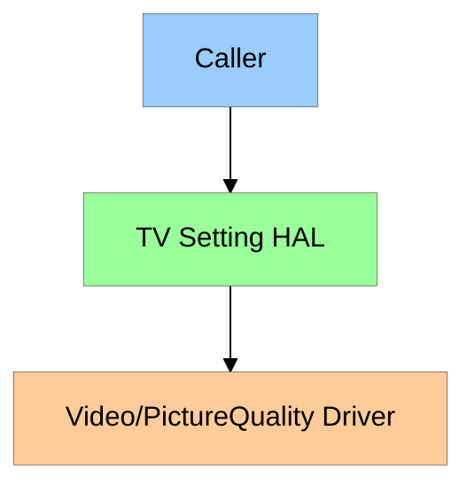
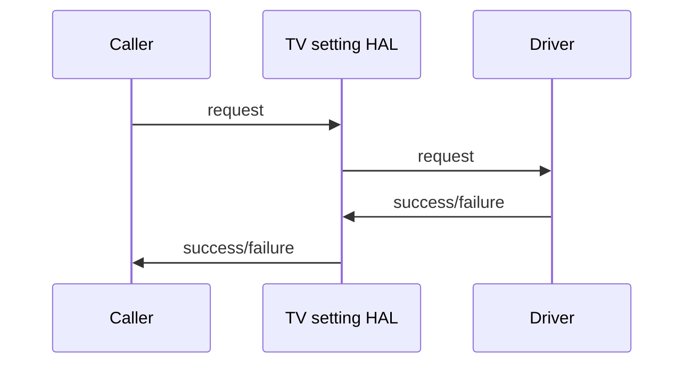
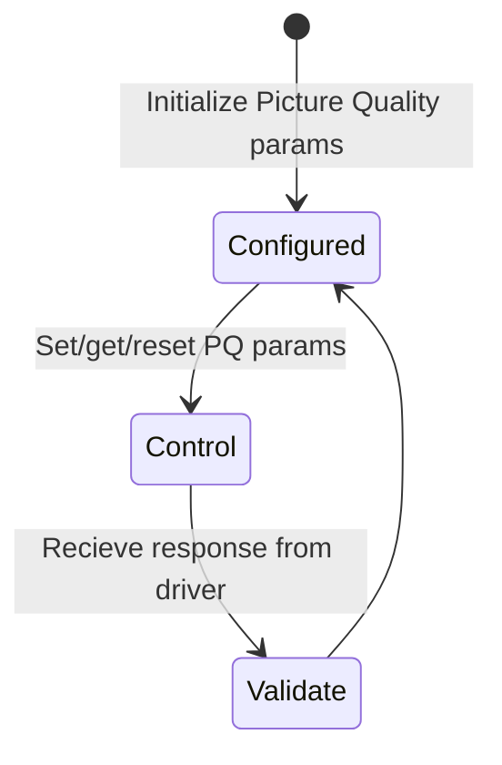

# TV Settings HAL Documentation

## Version History

| Date | Author | Comment | Version |
| --- | --------- | --- | --- |
| 24/03/23 | Review Team | Edited | 1.0.3 |
| 23/03/23 | Thanushree Rajaselvam | Addressed comments | 1.0.2 |
| 20/03/23 | Review Team | Edited | 1.0.1 |
| 16/11/22 | Aishwariya Bhaskar | First Release | 1.0.0 |

## Acronyms

| Acronym | Expansion |
| --- | --------- |
| CPU| Central Processing Unit |
| HAL| Hardware Abstraction layer |
| PQ| Picture Quality |
| SOC| System on chip |
| OEM| Original Equipment Manufacturer |
| ALS| Auto Light Sensor |

## Description

TV Settings HAL is an abstract layer, which provides APIs to Modify/Control the Picture quality parameters, dimming modes and auto backlight modes.

	
# Component Runtime Execution Requirements

## Initialization and Startup

The caller will initialize the TVSettings HAL APIs with picture quality modes for specific platforms and initiates communication with Picture Quality drivers.

 1. The specification of the TV Picure configuration will be defined in a config file([allmodes_template.conf](../../configs/allmodes_template.conf)) which decides supported formats, picture modes, dimming modes, dvModes, HDRModes, HLGModes, resolution etc.
 2. TV Settings HAL gets initialized by tvInit() API, which should initialize the parameters in the above config file aswell.

## Threading Model #TBC

TV Setting HAL is not required to be thread safe. 
There are no constraints on thread creation or signal handling. 

## Process Model

The interface is expected to support a single instantiation with a single process.

## Memory Model

The caller is responsible for allocating and cleaning up any memory used.

## Power Management Requirements

TV Settings HAL is not required to participate in power management.

## Asynchronous Notification Model

This interface requires callback notification registration for VideoFormatChange, VideoResolutionChange, VideoFrameRateChange. The caller must return the callback context as fast as possible and will not block.

## Blocking calls

There are no blocking calls in this interface.

## Internal Error Handling

All APIs must return error synchronously as return argument. The interface is responsible to handle system errors internally(e.g. out of memory).

## Persistence Model

Each vendor needs to define their own config file which is expected to be stored in rootfs and this must be a readonly.
Config file should contain the supported formats, picture modes, dimming modes, dvModes, HDRModes, HLGModes, resolution etc.

# Nonfunctional requirements

Following non functional requirement must be supported by the TV Settings HAL component.

## Logging and debugging requirements

There is no logging mechanism handled and printf() must be used.

## Memory and performance requirements

This interface is required not to cause excessive memory and CPU utilization.

## Quality Control

- This interface is required to perform static analysis, our preferred tool is Coverity.
- Have a zero-warning policy with regards to compiling. All warnings should be treated as error.
- Use of memory analysis tools like Valgrind are encouraged, to identify leaks/corruptions.
- HAL Tests will endeavour to create worst case scenarios to assist investigations
- Copyright validation is required to be performed, e.g.: Black duck, FossID.

## Licensing

This interface is expected to get released under the Apache License 2.0. 

## Build Requirements

TV Settings HAL source code must build into a shared library and must be named as libtvsettings-hal.so.
  
## Variability Management

Any changes in the APIs should be reviewed and approved by component architects.

## Platform or Product Customization

Product or platform specification requirements will be handled in vendor specific config file.

# Interface API Documentation

API documentation will be provided by Doxygen.

## Theory of operation and key concepts

This interface handles various functionalities related to Picture Quality settings such as:

- Brightness
- Contrast
- Hue
- Saturation
- White Balance
- Sharpness
- Color Temperature
- Backlight 
- Aspect Ratio
- Dimming Modes

There are other platform specific Picture Quality settings that can be managed by this interface such as:

- CMS
- Dolby Vision
- HDR
- HLG

### Diagrams

#### Operational Call Diagram

#### Functional Diagram

