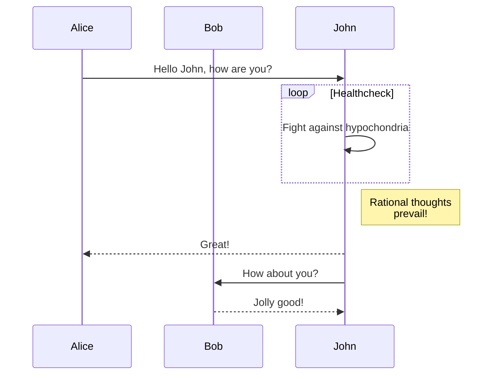
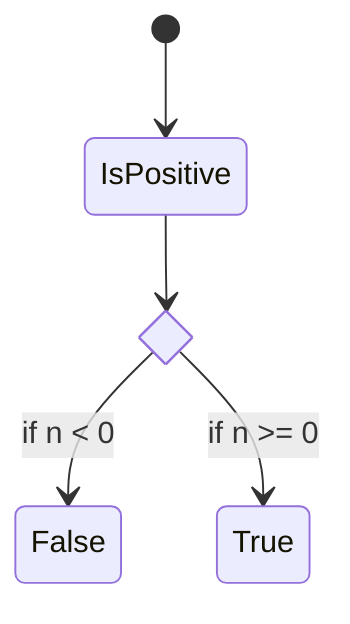

# Name_Of_Component HAL Documentation

## Component Runtime Execution Requirements

These requirements ensure that the component implementing the interface,
executes correctly within the run-time environment that it will be used.

Failure to meet these requirements will likely result in undefined and
unexpected behaviour.

## Initialization and Startup

Is the RDK-V middleware expected to have complete control over the life cycle
over the entity controlled by the interface?  
For example we have potential two types of entity for which an interface is
being abstracted:

  1. an entity that only needs to exist from initialisation and termination by the and RDK MW manager. When initialised, all resources are acquired, any hardware is opened and configured as a result of calls to interface methods and when terminated all resources are released. Typically the implementation would be self-contained within the library exposing the HAL interface, very probably providing a direct mapping onto a Linux device through a dev node

  2. an entity for which the HAL interface is a proxy. Here the entity is expected to be initialized from outside of the RDK middleware to perform some function before the RDK middleware is executing and ready

The first type is relatively straight forward, the second is more problematic
and needs to be called out and special cases need to be defined:

  1. What should happen when the component/sub-system is not ready. Should the interface block or return not ready. How should the client behave in both respects?

  2. Certain subsystems may have responsibility during system startup before RDK takes control. e.g FrontPanel, Panel and HDMI need to display a splash, etc. What is then the behaviour of the interface and how should it affect this initial state. When is the control hand-over and what state is the sub-system left in at that point? When is the sub-system initialized?

  3. etc.

All these points and others need to be called out so that the system behaves
in a deterministic manner, every time.

## Threading Model

Is it a requirement for the methods exposed by the interface to be thread
safe?

Another point is to define whether the library exposing the interface is
allowed to create threads. If it is allowed, explain the constraints, if any,
around signal handling that the component needs to comply with. If the library
is not allowed to create threads, and a separate thread of execution is
required, it is likely that this dictates the need for a separate process and
the proxy information above applies.

## Process Model

Is it a requirement for the component to support multiple instantiation from
multiple processes, or is there only ever one process that uses the interface?

## Memory Model

If the interface is expected to allocate and return pointers to memory, what
are the expected rules with respect to ownership, clean up and termination.

## Power Management Requirements

Is there a requirement for the component to participate in power management.  
If so how?  
e.g.  
Is it explicit: The component is terminated by the client before entering a
low power state and it expected that the component puts any associated
hardware in a low power mode?  
Is it implicit, in that when the system, is put in a low power state the
associated hardware is put into a low power state by the operating system
cooperating with the drivers?  
etc.

## Asynchronous Notification Model

Must the component support asynchronous notifications?  
If yes what is the approach?  
Callbacks?  
Blocked call?  
etc.  
If callbacks, the component will be providing the execution context, what are
the threading rules?

If messages are shared, what are responsibilities for managing the memory
allocation, etc.

## Blocking calls

Are any of the exposed methods allowed to block (sleep or make system calls
that can block)?  
Call out specific methods that are allowed to block.  
How is a blocked call prematurely terminated?

## Internal Error Handling

If the component detects an internal error (e.g. out of memory) what should it
do?

## Persistence Model

Is the sub-system interfaced to by the HAL interface expected to remember any
configuration set by calls to the HAL interface?  
How and when is the expected configuration to be applied. Linked to
Initialization and startup above.  
If configuration is expected to be maintained, how is it reset back to
defaults and what implications are there w.r.t upgrading and downgrading of
the subsystem.  
How would this be managed?

# Non functional requirements

Any non-functional requirements not specific to the operation of the
components and interfaces.

## Logging and debugging requirements

Is the component expected to provide logging for debug and diagnostic
purposes?  
If yes, are there any rules (file naming conventions, etc.) that the component
should abide by?

## Memory and performance requirements

Where memory and performance are of concern, Architecture may of imposed
limits on memory and CPU usage.

When the component is delivered, is there a requirement to state memory and
CPU usage statistics for auditing purposes

## Quality Control

Are there any requirements for the use of static code analysis tools:

e.g. Coverity, Black duck, etc.

Testing requirements: valgrind, etc. Any specific test to focus on, e.g.
longevity testing, etc.

What specific component tests should be run.

## Licensing

Are there any licensing requirements?

## Build Requirements

Any build requirements, specific tooling, library format, etc.

versions of specific support libraries. Ideally this would be a systemwide for
the RDK.

## Variability Management

How is evolution managed?

What optional methods are there and how are the capabilities of the interface
discovered?

If a method is not supported by a component or component dependent hardware
how is that managed?

Is there an expected approach for managing different interface library
versions?

## Platform or Product Customization

State whether the HAL component or sub-system it controls, is expected to
support some form of product or platform specific customization.

For example, for a RDK-TV product, picture modes are specific to a product and
the visual experience is tuned to meet product requirements. Each picture mode
is given a descriptive name for selection. Available picture modes are exposed
through the a get function.

Other interfaces may have properties that must be tuned for the specific HW,
or tailored at integration time to meet product requirements. Even, if the
resulting customization is invisible to the RDK and applications, it is useful
to state that customization is required at integration time for planning
purposes.

# Interface API Documentation

The information above mostly, but not only, details how the component/sub-
system behaves, realizes the interface, and the requirements/constrains that
it must abide by in doing so.  
This information below is more focused on how the interface should be used by
the client.

Any specific coding conventions that should be followed when extending the
interface.

## Theory of operation and key concepts

Describe anything useful to the stakeholders to help them understand the
expected operation of the interfaced component/s.  
For example,

If the component is expected to create instances of objects then describe
their life cycle and how they are identified.  
Is there an order in which methods are expected to be called?  
For example:

  1. Initialization/Open

  2. Configure

  3. Start

Are there specific methods that will only be called when in a specific state.  
Is there a state model?

State diagrams, sequence diagram, etc. are always a useful tool to describe
all the behavioural aspects of the components.

### Example Diagrams

#### Example Sequence Diagram

### Example sequenceDiagram using mermaid

[mermaid Diagrams](https://mermaid-js.github.io/mermaid)

#### Example State Diagram

### Example State Diagram using mermaid

[mermaid Diagrams](https://mermaid-js.github.io/mermaid)

graph LR
  A --- B
  B-->C[fa:fa-ban forbidden]
  B-->D(fa:fa-spinner);

## Data Structures and Defines

Each data structure should have a description of its role.  
Each field should have a description if it adds value. unsigned int index;
//is an index . Adds no value. "//Is an index to the array of foobars, to
select the foobar. " adds value.

## For Each Method

  * Description

    * Detailed semantic description on how to use.

  * Argument description, range of valid values, array lengths, etc.
  
    * Be especially careful with string arrays. Ideally the function would define exactly the mutability of the array contents.
    The classic error is where the client passes a pointer to a character array that has been created on the caller stack. If this is unknown to the component it may simply store the pointer value to the string expecting it to be valid if used at a later time. 

  * Pre-conditions: What must be done before calling. What happens if the pre-condition is not met

  * Post-conditions: What is the successful result

  * Return values. All possible return values and why

  * Error handling. Based on the error returned what should the Client do

  * Is the method allowed to block?

  * Is the method thread safe?

More on buffers:
char* is a mutable pointer to a mutable character/string.

const char* is a mutable pointer to an immutable character/string. You cannot change the contents of the location(s) this pointer points to. Also, compilers are required to give error messages when you try to do so. For the same reason, conversion from const char * to char* is deprecated.

char* const is an immutable pointer (it cannot point to any other location) but the contents of location at which it points are mutable.

const char* const is an immutable pointer to an immutable character/string.
