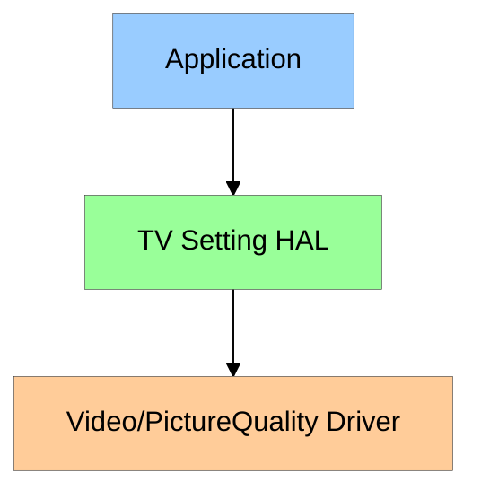
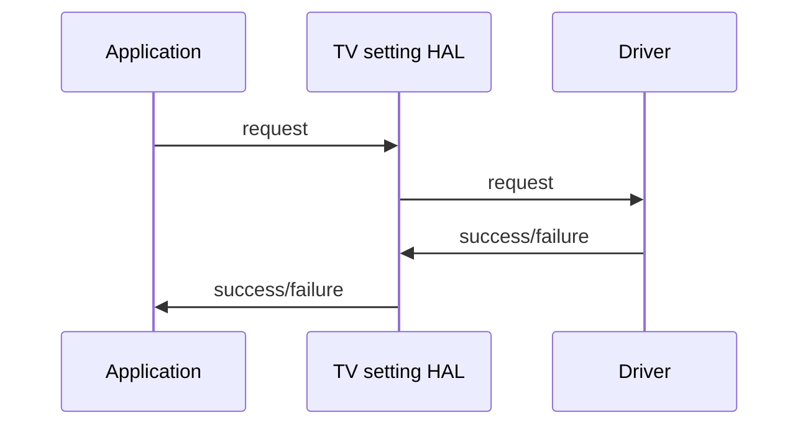

# TV Settings HAL Documentation

## Version History

| Date | Author | Comment | Version |
| --- | --------- | --- | --- |
| 16/11/22 | Aishwariya Bhaskar | First Release | 1.0.0 |
| 20/03/23 | Review Team | Edited | 1.0.1 |
| 23/03/23 | Thanushree Rajaselvam | Addressed comments | 1.0.2 |

## Acronyms

1. CPU - Central Processing Unit
2. HAL - Hardware Abstraction layer
3. PQ - Picture Quality
4. SOC - System on chip
5. OEM - Original Equipment Manufacturer
6. ALS - Auto Light Sensor

## Description

TV Settings HAL is an abstract layer, which provides APIs to Modify/Control the Picture quality parameters, dimming modes and auto backlight modes.

	
# Component Runtime Execution Requirements

Once the application is activated, it initializes the TVSettings HAL APIs with picture quality modes for specific platforms and initiates communication with Picture Quality drivers.
SOC is responsible for handling the PQ settings as per the request from caller via TV Settings HAL.

## Initialization and Startup

 1. The specification of the TV Picure configuration will be defined in a config file(sample provided in config folder) which decides supported formats, picture modes, dimming modes, dvModes, HDRModes, HLGModes, resolution etc.
 2. TV Settings HAL gets initialized by tvInit() API, which should initialize the parameters in the above config file aswell.
 3. The TV Settings HAL get/set methods will be used by caller to set/get/reset individual PQ params. 
 5. TV Settings HAL instance can be terminated using tvTerm().

## Threading Model

TV Setting HAL is thread safe.

## Process Model

The interface is expected to support a single instantiation with a single process.

## Memory Model

The caller is responsible to allocate, own the memory and clean up.

## Power Management Requirements

TV Settings HAL does participate in power management.

## Asynchronous Notification Model

The TV Setting HAL has callback registered for VideoFormatChange, VideoResolutionChange, VideoFrameRateChange. On any update, the TV Setting HAL will notify it to the caller.

## Blocking calls

There are no blocking calls in TV Settings HAL.

## Internal Error Handling

All the TV Settings HAL APIs must return error synchronously as return argument. HAL is responsible to handle system errors internally(e.g. out of memory).

## Persistence Model

Every OEM vendor has to define the config file in OEM layer.
Config file should contain the supported formats, picture modes, dimming modes, dvModes, HDRModes, HLGModes, resolution etc.

# Nonfunctional requirements

Following non functional requirement must be supported by the TV Settings HAL component.

## Logging and debugging requirements

There is no Logging mechanism handled in TVSetting HAL. As of now printf() is used to to dump the TVSetting HAL logs.

## Memory and performance requirements

TV Settings HAL must not contribute to excessive memory and CPU utilization while configuring Picture Quality settings.

## Quality Control

TV Settings HAL implementation should perform static analysis, our preferred tool is Coverity.

- Have a zero-warning policy with regards to compiling. All warnings should be treated as error.
- Use of memory analysis tools like Valgrind are encouraged, to identify leaks/corruptions.
- HAL Tests will endeavour to create worst case scenarios to assist investigations

## Licensing

TV Settings HAL implementation is expected to get released under the Apache License 2.0. 

## Build Requirements

TV Settings HAL source code must be built by linking the shared library(libtvsettings-hal.so).
  
## Variability Management

Any changes in the APIs should be reviewed and approved by COMCAST.

## Platform or Product Customization

Product or platform specification requirements for a specific product can be handled in TV Settings HAL and modified in the config file.

# Interface API Documentation

API documentation will be provided.

## Theory of operation and key concepts

- The TV Settings HAL acts as interface between the TV ControlSettings Thunder Plugin and Picture Quality drivers for handling various functionalities related to Picture Quality settings such as Brightness, Contrast, Hue, Saturation, Luminence, White Balance, Sharpness, Color Temperature, Backlight, Aspect Ratio etc., 
- The setting chage request using remote is sent to application and it navigates as a curl request to Control Setting Thunder plugin which then extracts the response and sends to TV Settings HAL.
- TThis HAL will then sends the corresponding request to driver to perform the necessary operation

### UML Diagrams

#### Sequence Diagram

#### State Diagram

