# TV Settings HAL Documentation

 

## Table of Contents

 

* [Acronyms, Terms and Abbreviations](#acronyms-terms-and-abbreviations)

* [Description](#description)

* [Component Runtime Execution Requirements](#component-runtime-execution-requirements)

 

  * [Initialization and Startup](#initialization-and-startup)

 

    * [Table Format](#table-format)

  * [Threading Model](#threading-model)

  * [Process Model](#process-model)

  * [Memory Model](#memory-model)

  * [Power Management Requirements](#power-management-requirements)

  * [Asynchronous Notification Model](#asynchronous-notification-model)

  * [Blocking calls](#blocking-calls)

  * [Internal Error Handling](#internal-error-handling)

  * [Persistence Model](#persistence-model)

* [Non-functional requirements](#non-functional-requirements)

 

  * [Logging and debugging requirements](#logging-and-debugging-requirements)

  * [Memory and performance requirements](#memory-and-performance-requirements)

  * [Quality Control](#quality-control)

  * [Licensing](#licensing)

  * [Build Requirements](#build-requirements)

  * [Variability Management](#variability-management)

  * [Platform or Product Customization](#platform-or-product-customization)

* [Interface API Documentation](#interface-api-documentation)

 

  * [Theory of operation and key concepts](#theory-of-operation-and-key-concepts)

  * [Tables](#tables)

  * [Diagrams](#diagrams)

 

---

 

## Acronyms, Terms and Abbreviations

 

* `CPU` - Central Processing Unit

* `HAL` - Hardware Abstraction Layer

* `PQ`  - Picture Quality

* `SOC` - System on Chip

* `OEM` - Original Equipment Manufacturer

* `ALS` - Auto Light Sensor

* `API` - Application Programming Interface

* `DV`  - Dolby Vision

* `CMS` - Colorspace Management System

* `TMAX`- Temperature MAX

* `SRD` - Standard Dynamic Range

* `HDR` - High Dynamic Range

* `HLG` - Hybrid Log Gamma

* `UHD` - Ultra High Definition

* `LDIM`- Local Dimming

 

---

 

## Description

 

TV Settings HAL provides APIs to modify and control picture quality parameters, dimming modes, and auto backlight modes.

 

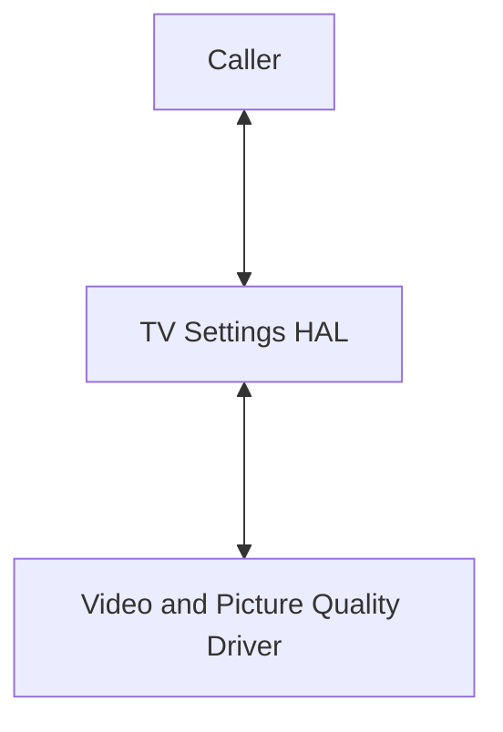

 

---

 

## Component Runtime Execution Requirements

 

### Initialization and Startup

 

The platform capabilities are defined in

[`pq_capabilities.json`](https://github.com/rdkcentral/rdkv-halif-tvsettings/config/pq_capabilities.json).

 

This JSON describes supported formats, modes, dimming levels, DV modes, resolution, etc. It is **illustrative only** and not consumed at runtime by middleware or applications. The HAL API surface remains authoritative.

 

On boot:

 

* `tvInit()` initialises default PQ parameters defined by the SoC vendor.

* Default profiles are copied into override profiles.

* Caller invokes HAL APIs to change parameters; changes persist in override DB.

 

#### Example `pq_capabilities.json` Structure

 

```json

{

  "Backlight": {

    "rangeInfo": { "from": 0, "to": 100 },

    "platformSupport": true,

    "context": {

      "Sports": { "SDR": ["HDMI1", "HDMI2", "IP"] },

      "Game":   { "HDR10": ["HDMI1", "HDMI2"] }

    }

  },

  "Brightness": {

    "rangeInfo": { "from": 0, "to": 100 },

    "platformSupport": true

  },

  "ColorTemperature": {

    "rangeInfo": {

      "options": ["Standard", "Warm", "Cold", "UserDefined"]

    },

    "platformSupport": true

  }

}

```

 

---

 

### Threading Model

 

The HAL is not required to be thread safe.

Callbacks must not block or be re-entrant.

 

---

 

### Process Model

 

Single instantiation, single process supported.

 

---

 

### Memory Model

 

Callers allocate/frees memory unless HAL returns internal structures (e.g., `tvContextCaps_t**`), which remain valid for the lifetime of the process.

 

---

 

### Power Management Requirements

 

No explicit power management required.

 

---

 

### Asynchronous Notification Model

 

Callbacks for VideoFormatChange, VideoResolutionChange, VideoFrameRateChange, and VideoContentChange must return immediately.

 

Ordering recommendation: **Format → Resolution → FrameRate → Content**.

 

---

 

### Blocking calls

 

* Fast path (<10ms): All Get/Set APIs

* Slow path (<100ms): DB reloads, reapplying PQ after format changes

* Async required for operations exceeding thresholds

 

---

 

### Internal Error Handling

 

| Error Code                        | Meaning                           | Caller Action              |

| --------------------------------- | --------------------------------- | -------------------------- |

| `tvERROR_NONE`                    | Success                           | Continue                   |

| `tvERROR_OPERATION_NOT_SUPPORTED` | Not supported on platform/context | Skip gracefully            |

| `tvERROR_INVALID_STATE`           | Invalid lifecycle state           | Retry after re-init        |

| `tvERROR_INVALID_PARAM`           | Invalid/out-of-range arg          | Clamp/retry                |

| `tvERROR_UNKNOWN`                 | Unspecified error                 | Log, retry/fail gracefully |

 

---

 

### Persistence Model

 

Vendor config file (read-only, rootfs) defines supported features.

Default DB copied to override DB at boot.

 

---

 

## Non-functional requirements

 

* **Logging**: DEBUG, INFO, ERROR. DEBUG disabled by default.

* **Performance**: No excessive memory/CPU usage.

* **Quality**: Coverity, Valgrind, Black Duck/FossID, zero warnings.

* **Build**: Outputs `libtvsettings-hal.so`.

* **Versioning**: Header-based versioning; JSON only illustrative.

 

---

 

## Interface API Documentation

 

### Theory of operation and key concepts

 

* Brightness, Contrast, Hue, Saturation, Sharpness

* Colour Temperature

* White Balance

* Backlight, Aspect Ratio, Dimming Modes, Local Dimming Level

* Low Latency Mode

* Video Format/Resolution/FrameRate/Content notifications

 

**White Balance Model:**

 

* Gains: 0–2047

* Offsets: −1024 to +1024

* Enums: `R_GAIN`, `G_GAIN`, `B_GAIN`, `R_POST_OFFSET`, `G_POST_OFFSET`, `B_POST_OFFSET`

 

**Colour Temperature Strings vs Enums:**

 

| JSON string   | API enum                     |

| ------------- | ---------------------------- |

| Standard      | `tvColorTemp_STANDARD`       |

| Warm          | `tvColorTemp_WARM`           |

| Cold          | `tvColorTemp_COLD`           |

| UserDefined   | `tvColorTemp_USER`           |

| BoostStandard | `tvColorTemp_BOOST_STANDARD` |

| BoostWarm     | `tvColorTemp_BOOST_WARM`     |

| BoostCold     | `tvColorTemp_BOOST_COLD`     |

| BoostUser     | `tvColorTemp_BOOST_USER`     |

 

---

 

## Tables

 

### Picture Property Table

 

| Video Source | Video Format | Picture Mode | Picture Property           |

| ------------ | ------------ | ------------ | -------------------------- |

| HDMI1        | SDR          | Standard     | Brightness, Contrast, Hue… |

| HDMI1        | HDR10        | Standard     | Brightness, Contrast, Hue… |

| HDMI2        | SDR/HDR10    | Standard     | Repeat as HDMI1            |

| IP           | SDR/HDR10    | Standard     | Repeat as HDMI1            |

 

---

 

### Picture Association Table

 

| Video Source | Video Format | Picture Mode(s)               |

| ------------ | ------------ | ----------------------------- |

| HDMI1        | SDR          | Standard, Movie, Sports, Game |

| HDMI1        | HDR10        | Standard, Movie, Sports, Game |

| HDMI2        | SDR/HDR10    | Repeat as HDMI1               |

| IP           | SDR/HDR10    | Repeat as HDMI1               |

 

---

 

### White Balance Table

 

| Video Source | WB Table    | Property          | Value Range     |

| ------------ | ----------- | ----------------- | --------------- |

| HDMI1        | Cold        | R/G/B Gain        | 0–2047          |

| HDMI1        | Cold        | R/G/B Offset      | −1024 to +1024  |

| HDMI1        | Warm/Normal | R/G/B Gain/Offset | Repeat as Cold  |

| HDMI2/IP     | All modes   | All properties    | Repeat as HDMI1 |

 

---

 

### Gamma Table

 

| Gamma Table   | Index | Property   | Value Range |

| ------------- | ----- | ---------- | ----------- |

| Cold/Warm/... | 0–255 | R/G/B Gain | 0–1023      |

 

---

 

### TMAX Table

 

| Mode      | Value Range |

| --------- | ----------- |

| Non-Boost | 0–10000     |

| Boost     | 0–10000     |

| Burst     | 0–10000     |

 

---

 

## Diagrams

 

### Init and Callback Sequence

 

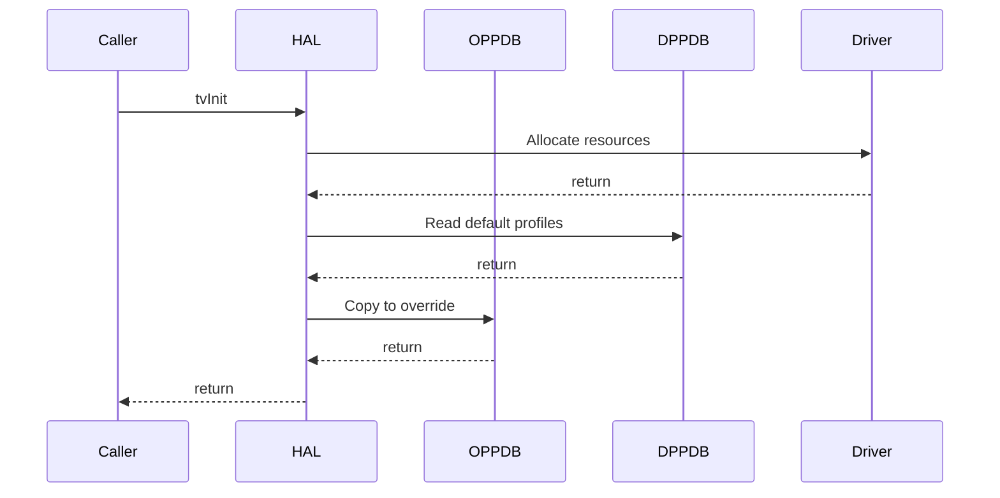

 

### Set/Get/Save Picture Quality

 

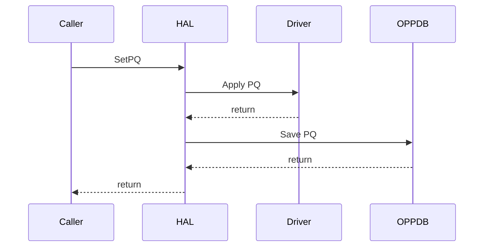

 

### Set With SaveOnly Flag

 

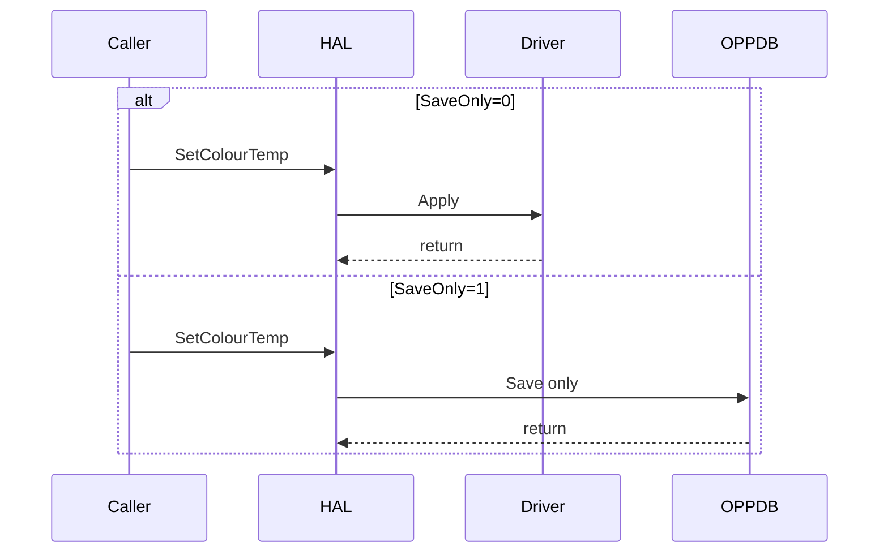

 

### Gamma/TMAX Sequence

 

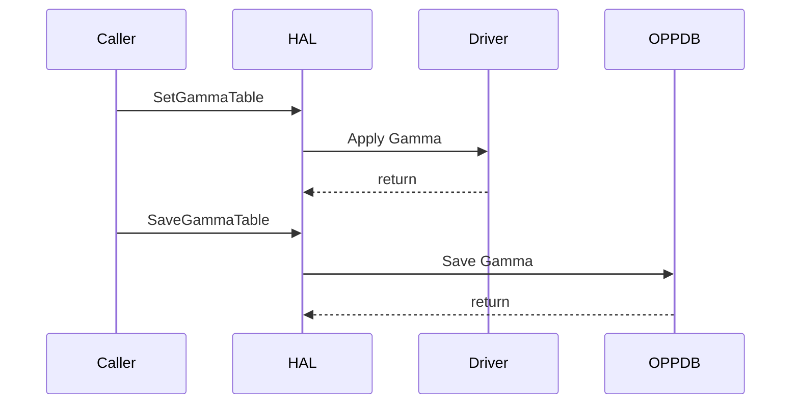

 

### Terminate Sequence

 

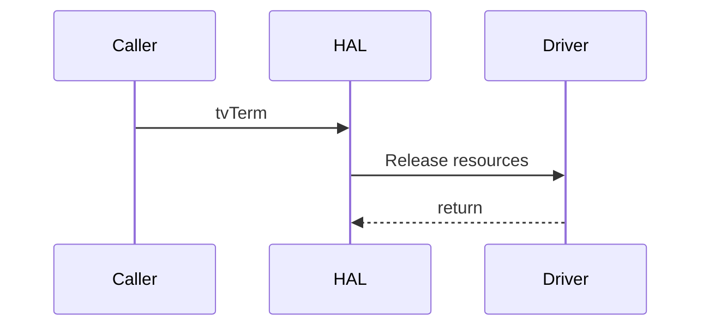

 

### Functional State Diagram

 

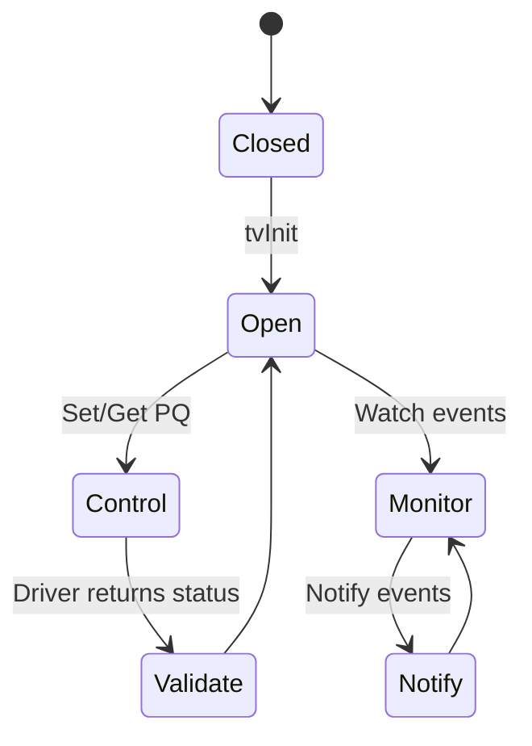

 

From: Weatherup, Gerald (Senior Product Architect) <Gerald.Weatherup@sky.uk>
Sent: Tuesday, September 2, 2025 17:46
To: Patel, Utkarsh (Senior Software Engineer) <utkarsh.patel@sky.uk>
Subject: New doc - how does this look?

 

# TV Settings HAL Documentation

 

## Table of Contents

 

* [Acronyms, Terms and Abbreviations](#acronyms-terms-and-abbreviations)

* [Description](#description)

* [Component Runtime Execution Requirements](#component-runtime-execution-requirements)

 

  * [Initialization and Startup](#initialization-and-startup)

 

    * [Table Format](#table-format)

  * [Threading Model](#threading-model)

  * [Process Model](#process-model)

  * [Memory Model](#memory-model)

  * [Power Management Requirements](#power-management-requirements)

  * [Asynchronous Notification Model](#asynchronous-notification-model)

  * [Blocking calls](#blocking-calls)

  * [Internal Error Handling](#internal-error-handling)

  * [Persistence Model](#persistence-model)

* [Non-functional requirements](#non-functional-requirements)

 

  * [Logging and debugging requirements](#logging-and-debugging-requirements)

  * [Memory and performance requirements](#memory-and-performance-requirements)

  * [Quality Control](#quality-control)

  * [Licensing](#licensing)

  * [Build Requirements](#build-requirements)

  * [Variability Management](#variability-management)

  * [Platform or Product Customization](#platform-or-product-customization)

* [Interface API Documentation](#interface-api-documentation)

 

  * [Theory of operation and key concepts](#theory-of-operation-and-key-concepts)

  * [Diagrams](#diagrams)

 

## Acronyms, Terms and Abbreviations

 

* `CPU` - Central Processing Unit

* `HAL` - Hardware Abstraction Layer

* `PQ`  - Picture Quality

* `SOC` - System on Chip

* `OEM` - Original Equipment Manufacturer

* `ALS` - Auto Light Sensor

* `API` - Application Programming Interface

* `DV`  - Dolby Vision

* `CMS` - Colorspace Management System

* `TMAX`- Temperature MAX

* `SRD` - Standard Dynamic Range

* `HDR` - High Dynamic Range

* `HLG` - Hybrid Log Gamma

* `UHD` - Ultra High Definition

* `LDIM`- Local Dimming

 

## Description

 

TV Settings HAL is an interface which provides APIs to modify and control picture quality parameters, dimming modes and auto backlight modes.

 


 

## Component Runtime Execution Requirements

 

### Initialization and Startup

 

The caller must initialize the APIs with picture quality modes for specific platforms and initiate communication with picture quality drivers.

 

The capabilities of a specific platform with respect to TV picture configuration are defined in a config file `pq_capabilities.json`. This JSON expresses supported formats, picture modes, dimming modes, DV modes, resolution, etc. It is illustrative and platform-tailored, not consumed directly by middleware or apps. The HAL API surface remains the contract.

 

Caller must initialize by calling `tvInit()` which initializes the parameters in the default picture property database. These parameters are decided by the SoC vendor based on platform capability. On every bootup the default picture profile database will be copied to the override picture profile database.

 

#### Capability Discovery

 

Vendors may extend `pq_capabilities.json` for their platforms, but the HAL exposes only the enums defined in `tvTypes.h`. If a capability is not available on a platform/context, the HAL API must indicate that through return codes (e.g., `tvERROR_OPERATION_NOT_SUPPORTED`).

 

**Example JSON structure (illustrative):**

 

```json

{

  "Backlight": {

    "rangeInfo": { "from": 0, "to": 100 },

    "platformSupport": true,

    "context": {

      "Sports": { "SDR": ["HDMI1", "HDMI2", "IP"] },

      "Game":   { "HDR10": ["HDMI1", "HDMI2"] }

    }

  },

  "Brightness": {

    "rangeInfo": { "from": 0, "to": 100 },

    "platformSupport": true

  },

  "ColorTemperature": {

    "rangeInfo": {

      "options": ["Standard", "Warm", "Cold", "UserDefined"]

    },

    "platformSupport": true

  }

}

```

 

This example shows how ranges, support flags, and context mappings are expressed. Actual platform JSONs may add or omit fields as needed.

 

---

 

### Threading Model

 

This interface is not required to be thread safe.

There are no constraints on thread creation or signal handling.

 

---

 

### Process Model

 

This interface is expected to support a single instantiation with a single process.

 

---

 

### Memory Model

 

The caller is responsible for allocating and cleaning up any memory used.

 

Some APIs return HAL-allocated structures (e.g., `tvContextCaps_t**`). These are owned by the HAL and remain valid for the lifetime of the process. The caller must not free them.

 

---

 

### Power Management Requirements

 

This interface is not required to participate in power management.

 

---

 

### Asynchronous Notification Model

 

This interface requires callback notification registration for VideoFormatChange, VideoResolutionChange, VideoFrameRateChange, and VideoContentChange.

 

Callbacks are invoked in a HAL-managed thread context. They are not re-entrant, and ordering is not guaranteed unless explicitly documented. Recommended order of notification: Format → Resolution → FrameRate → Content. Callers must return from the callback quickly.

 

---

 

### Blocking calls

 

This interface is required to have no blocking calls.

 

Guidance:

 

* Fast-path (<10ms): All Get/Set APIs.

* Slow-path (<100ms): DB reloads or PQ re-application after format change.

* Operations expected to exceed these thresholds must use asynchronous paths.

 

---

 

### Internal Error Handling

 

All APIs must return errors synchronously as return values.

 

Standard error codes include:

 

| Error Code                        | Meaning                                           | Caller Action                 |

| --------------------------------- | ------------------------------------------------- | ----------------------------- |

| `tvERROR_NONE`                    | Operation successful                              | Continue                      |

| `tvERROR_OPERATION_NOT_SUPPORTED` | Capability not supported on this platform/context | Degrade gracefully or skip    |

| `tvERROR_INVALID_STATE`           | Operation attempted in invalid lifecycle state    | Retry after re-init           |

| `tvERROR_INVALID_PARAM`           | Argument out of range or invalid                  | Clamp/retry with valid value  |

| `tvERROR_UNKNOWN`                 | Unspecified internal error                        | Log, retry or fail gracefully |

 

---

 

### Persistence Model

 

Each vendor must define their own config file (read-only, in rootfs).

The config must contain supported formats, picture modes, dimming modes, DV modes, resolution etc.

 

---

 

## Non-functional requirements

 

Following non-functional requirement must be supported by the TV Settings HAL component:

 

### Logging and debugging requirements

 

This interface is required to support DEBUG, INFO and ERROR messages. DEBUG must be disabled by default and enabled when needed.

 

---

 

### Memory and performance requirements

 

This interface must not cause excessive memory or CPU utilization.

 

---

 

### Quality Control

 

* Perform static analysis, preferred tool: Coverity.

* Zero-warning policy when compiling.

* Memory analysis (Valgrind) encouraged.

* Copyright validation (Black Duck, FossID) required.

* Tests must cover worst-case scenarios.

 

---

 

### Licensing

 

This interface is expected to be released under the Apache License 2.0.

 

---

 

### Build Requirements

 

TV Settings HAL source code must build into a shared library and must be named as `libtvsettings-hal.so`.

 

---

 

### Variability Management

 

Any changes in the APIs must be reviewed and approved by component architects.

 

Capability variability is expressed in JSON; API variability is strictly versioned in headers (`tvTypes.h`).

 

---

 

### Platform or Product Customization

 

Product or platform specific requirements (e.g., PQ tuning, picture modes) must be handled in vendor-specific config files.

 

---

 

## Interface API Documentation

 

API documentation is generated by Doxygen from header files.

 

### Theory of operation and key concepts

 

This interface handles the following functionalities:

 

* Brightness

* Contrast

* Hue

* Saturation

* Sharpness

* Color Temperature

* White Balance

* Backlight

* Aspect Ratio

* Dimming Modes

* Local Dimming Level

* Low Latency

* Notifications: Video Format, Resolution, FrameRate, Content

 

**White Balance Model**

 

* Parameters: R/G/B gains (0–2047), offsets (−1024 to +1024).

* Exposed via `tvRGBType_t` enums (`R_GAIN`, `G_GAIN`, `B_GAIN`, `R_POST_OFFSET`, `G_POST_OFFSET`, `B_POST_OFFSET`).

* Calibration may be global or per-source, using `tvColorTempSourceOffset_t`.

* Defaults are vendor-calibrated; overrides persist in DB.

 

**Colour Temperature: Strings vs Enums**

 

* HAL APIs use `tvColorTemp_t` enums (authoritative).

* JSON uses strings (illustrative/reference).

* Reference mapping:

 

| JSON string     | API enum                     |

| --------------- | ---------------------------- |

| `Standard`      | `tvColorTemp_STANDARD`       |

| `Warm`          | `tvColorTemp_WARM`           |

| `Cold`          | `tvColorTemp_COLD`           |

| `UserDefined`   | `tvColorTemp_USER`           |

| `BoostStandard` | `tvColorTemp_BOOST_STANDARD` |

| `BoostWarm`     | `tvColorTemp_BOOST_WARM`     |

| `BoostCold`     | `tvColorTemp_BOOST_COLD`     |

| `BoostUser`     | `tvColorTemp_BOOST_USER`     |

 

If a valid enum is not supported on a given platform/context, the HAL returns `tvERROR_OPERATION_NOT_SUPPORTED`.

 

---

 

### Diagrams

 

#### Operational Call Diagram

 

##### Init and Callback Sequence

 

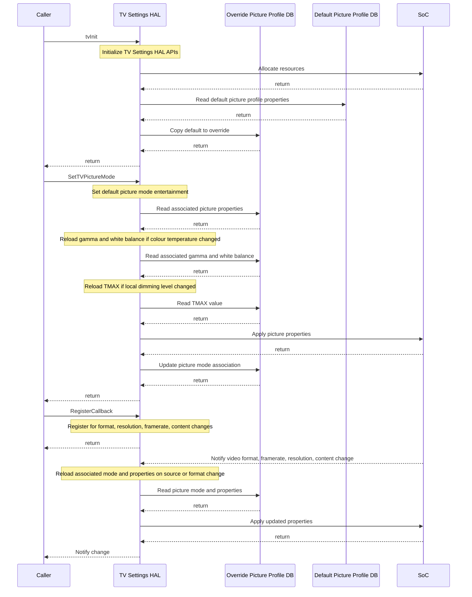

##### Set/Get/Save Picture Quality Parameter Sequence
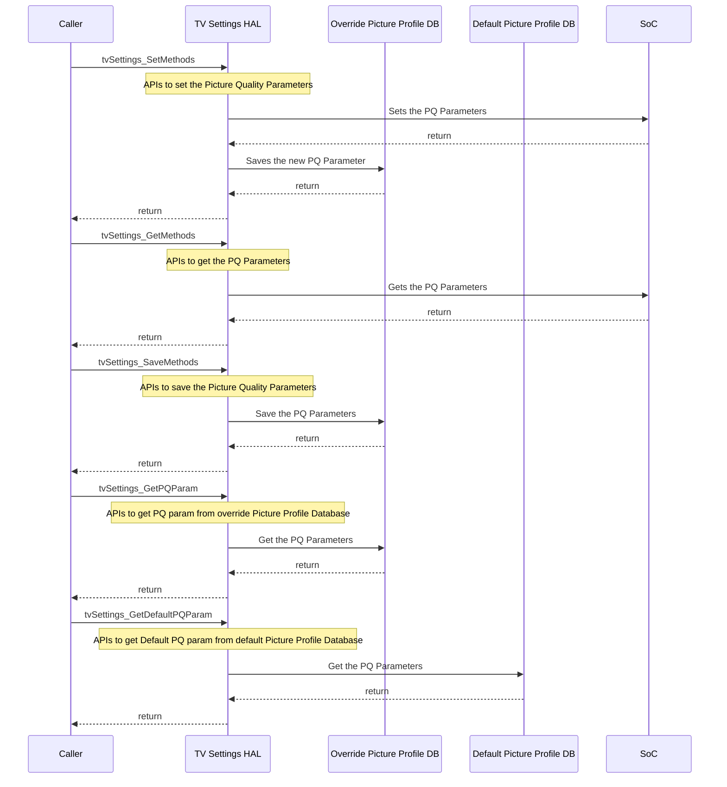
<h5> LEGEND: </h5>

<h5>tvSettings_SetMethods:</h5>
SetBrightness(), SetContrast(), SetSaturation(), SetHue(),SetSharpness(), SetColorTemperature(),SetBacklight(), etc..

<h5>tvSettings_GetMethods:</h5> 
GetBrightness(), GetContrast(), GetSaturation(), GetHue(),GetSharpness(), GetColorTemperature(),GetBacklight(), GetPQParams(), GetDefaultPQParams() etc..
 
<h5>tvSettings_SaveMethods :</h5> 
SaveBrightness(), SaveContrast(), SaveSaturation(), SaveHue(),SaveSharpness(), SaveColorTemperature(),SaveBacklight(), etc..
  
<h5>RegisterCallback :</h5>
RegisterVideoFormatChangeCB(),RegisterVideoContentChangeCB(),RegisterVideoResolutionChangeCB(), RegisterVideoFrameRateChangeCB()

##### Set With SaveOnly Flag Sequence

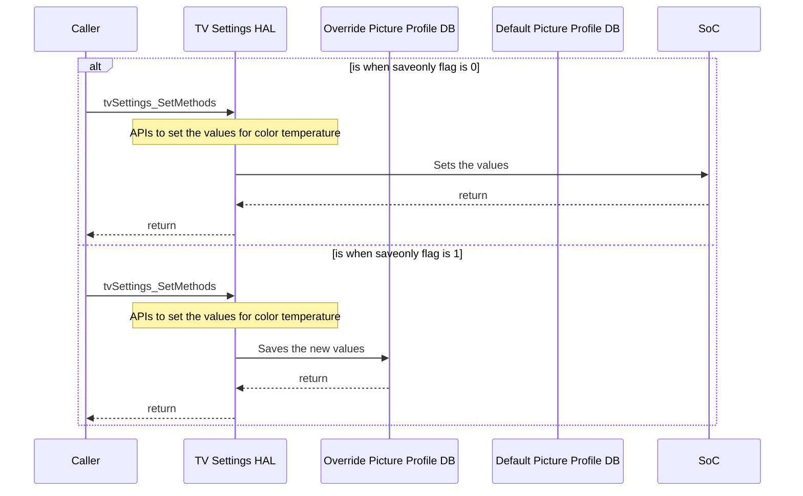
<h5> LEGEND: </h5>

<h5>tvSettings_SetMethods:</h5>
SetColorTemp_Rgain_onSource(), SetColorTemp_Ggain_onSource(), SetColorTemp_Bgain_onSource(), SetColorTemp_R_post_offset_onSource(), SetColorTemp_G_post_offset_onSource(), SetColorTemp_B_post_offset_onSource()

##### Gamma/TMax sequence(set and save)

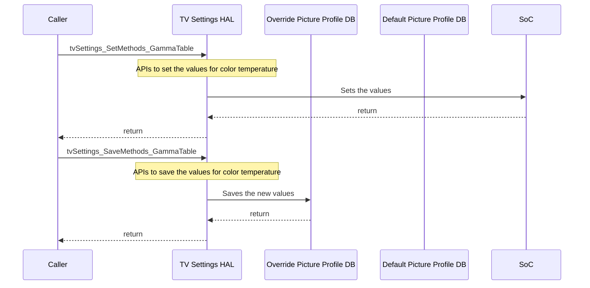
<h5> LEGEND: </h5>

<h5>tvSettings_SetMethods:</h5>
SetGammaTable(), SetDvTmaxValue()
 
<h5>tvSettings_SaveMethods :</h5> 
SaveGammaTable(), SaveDvTmaxValue()

##### Terminate Sequence
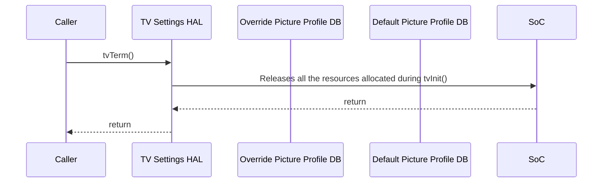

#### Functional Diagram

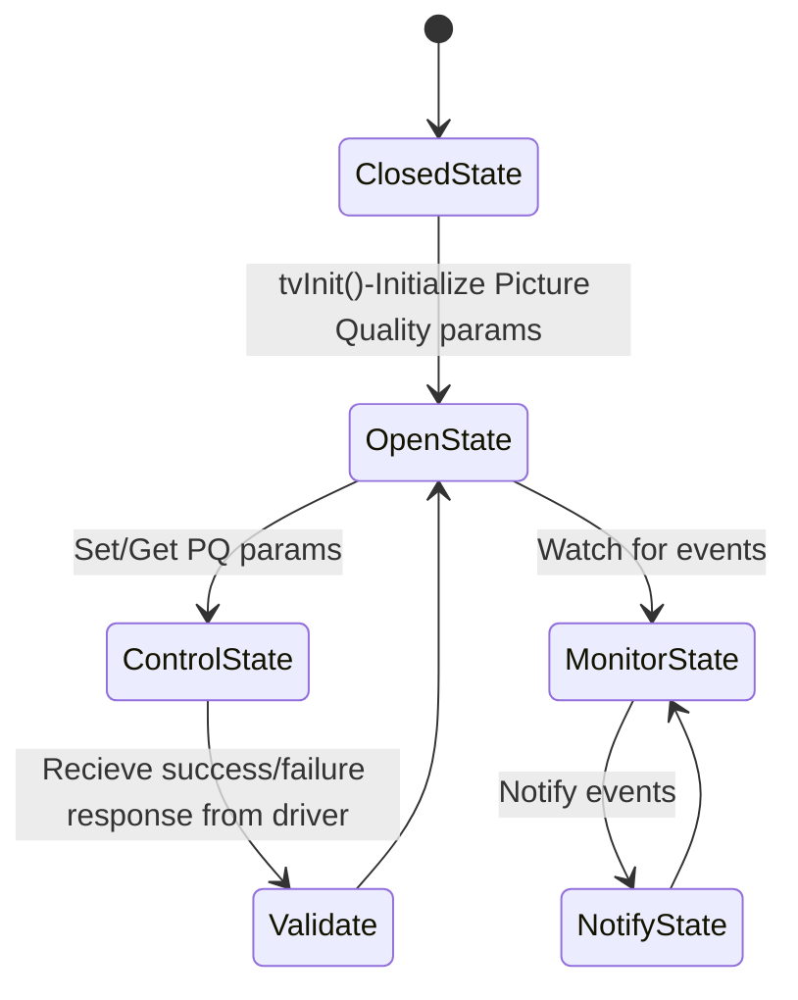
