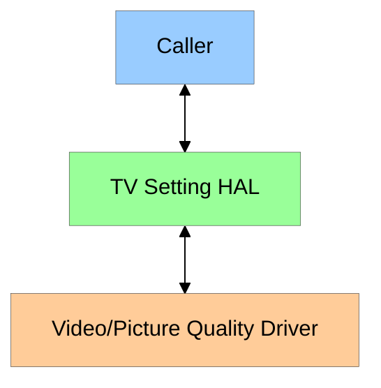
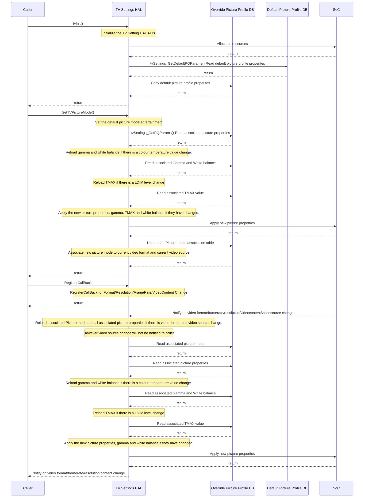
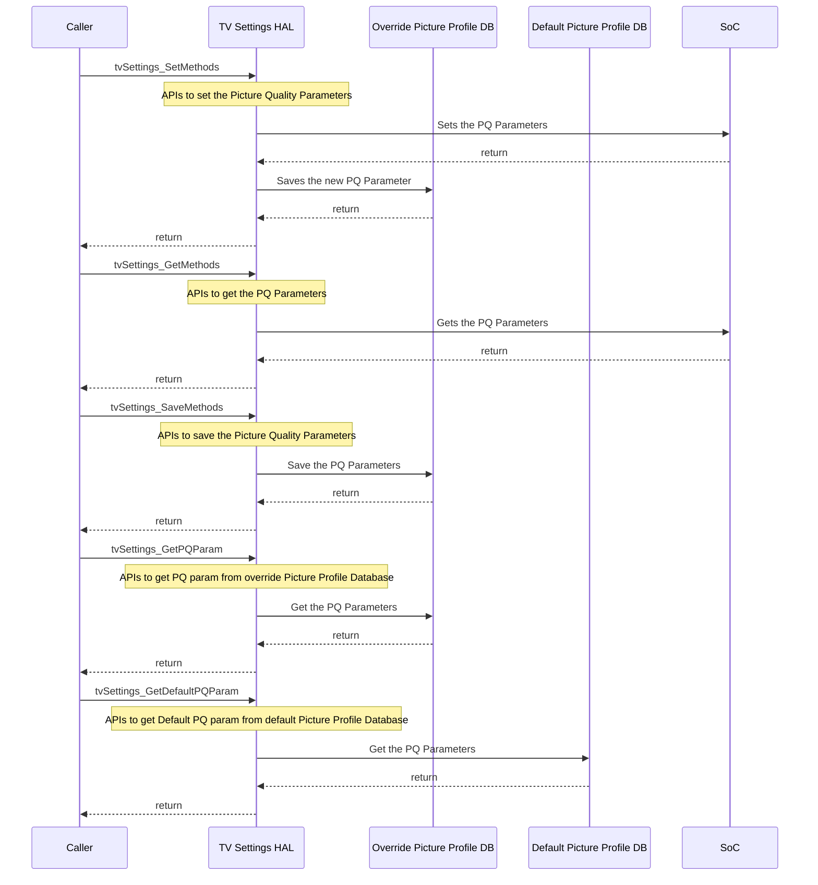
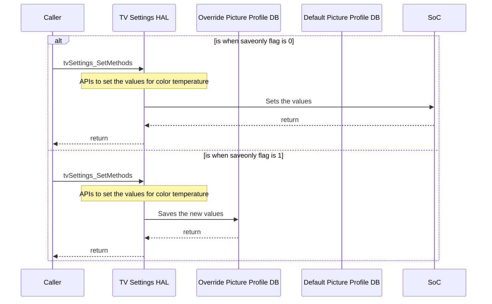
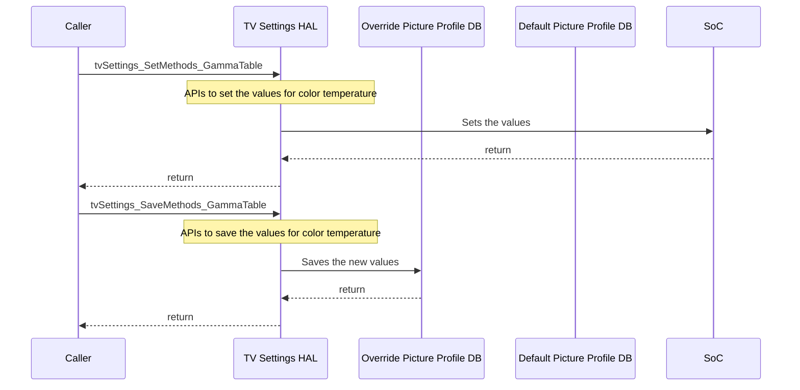
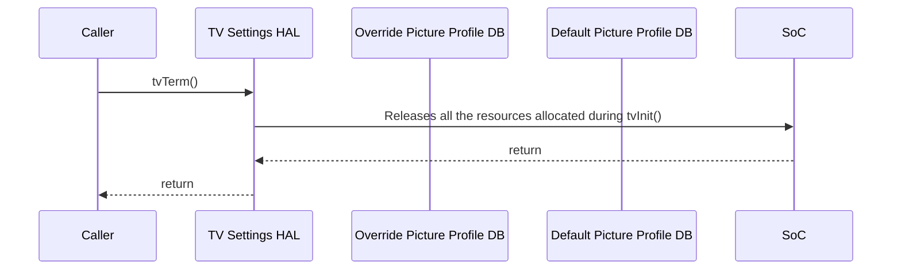
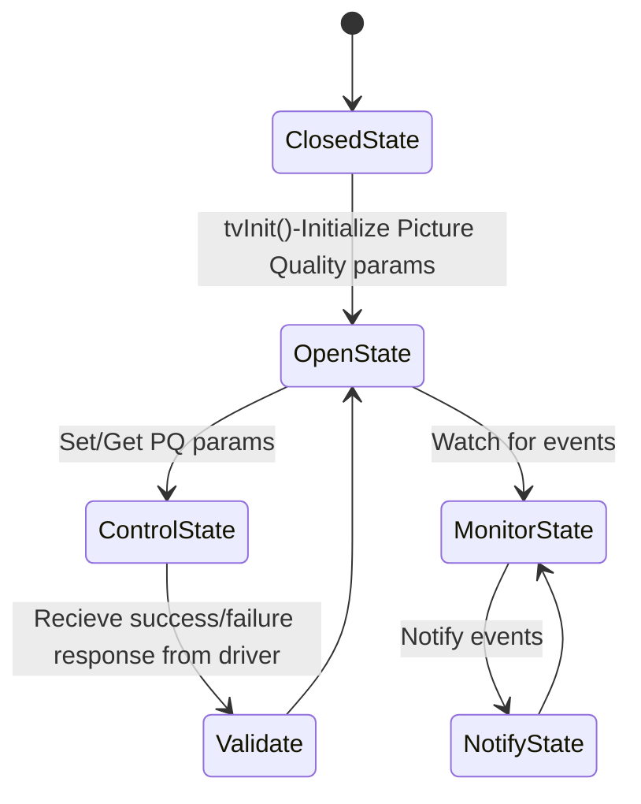

# TV Settings HAL Documentation

## Table of Contents

- [Acronyms, Terms and Abbreviations](#acronyms-terms-and-abbreviations)
- [Description](#description)
- [Component Runtime Execution Requirements](#component-runtime-execution-requirements)
  - [Initialization and Startup](#initialization-and-startup)
  	- [Table Format](#table-format) 
  - [Threading Model](#threading-model)
  - [Process Model](#process-model)
  - [Memory Model](#memory-model)
  - [Power Management Requirements](#power-management-requirements)
  - [Asynchronous Notification Model](#asynchronous-notification-model)
  - [Blocking calls](#blocking-calls)
  - [Internal Error Handling](#internal-error-handling)
  - [Persistence Model](#persistence-model)
- [Non-functional requirements](#non-functional-requirements)
  - [Logging and debugging requirements](#logging-and-debugging-requirements)
  - [Memory and performance requirements](#memory-and-performance-requirements)
  - [Quality Control](#quality-control)
  - [Licensing](#licensing)
  - [Build Requirements](#build-requirements)
  - [Variability Management](#variability-management)
  - [Platform or Product Customization](#platform-or-product-customization)
- [Interface API Documentation](#interface-api-documentation)
  - [Theory of operation and key concepts](#theory-of-operation-and-key-concepts)
  - [Diagrams](#diagrams)

## Acronyms, Terms and Abbreviations

- `CPU` - Central Processing Unit
- `HAL` - Hardware Abstraction layer
- `PQ`  - Picture Quality
- `SOC` - System on chip
- `OEM` - Original Equipment Manufacturer
- `ALS` - Auto Light Sensor
- `API` - Application Programming Interface
- `DV`  - Dolby Vision
- `CMS` - Colorspace Management System
- `TMAX`- Temperature MAX
- `SRD` - Standard Dynamic Range
- `HDR` - High Dynamic Range
- `HLG` - Hybrid Log Gamma
- `UHD` - Ultra High Definition
- `LDIM`- Local Dimming

## Description

TV Settings `HAL` is an interface which provides `APIs` to modify/control the picture quality parameters, dimming modes and auto backlight modes.

	
## Component Runtime Execution Requirements

### Initialization and Startup

The caller must initialize the `APIs` with picture quality modes for specific platforms and initiates communication with picture quality drivers. The standard/default values shall be maintained in default Picture profile database and any modified values for these parameters using TV Settings HAL APIs will be maintained in override Picture profile database. HAL shall be responsible to store these Picture profile data into the database.
Picture profile database will have 5 types of tables:
1. Picture property table to maintain all picture properties for a given picture mode, video format and video source
2. Picture mode association table maintain the association of a given video source and video format to a picture mode
3. If input source, picture mode, and video format are not already set or specified, they will default to "IP source," "Entertainment," and "SDR," respectively. However, if the caller attempts to change parameters that rely on these values, they will be acted upon default values accordingly.
4. White balance table for every color temperature and video source to maintain WB calibrated values
5. Gamma table for every color temperature to maintain the gamma calibrated values.
6. TMAX table for every local dimming level to maintain the TMAX value

- The capabilities of a specific platform with respect to TV picture configuration will be defined in a config file ([pq_capablities.ini](../../config/pq_capablities.ini "pq_capablities.ini")) which decides supported formats, picture modes, dimming modes, dvModes, resolution etc.
- Caller must initialize by calling `tvInit()` which must initialize the parameters in default picture property database. These parameters are decided by Soc vendor  based on platform capability.
- On every bootup the default picture profile database will be copied to override picture profile database.
  
#### Table Format
##### Picture Property Table
| Video Source | Video Format | Picture Mode | Picture Property |
| --- | --- | --- | --- |
| HDMI1 | SDR | Standard/Entertainment | Brightness |
|  |  |  | Contrast |
|  |  |  | Sharpness |
|  |  |  | Saturation |
|  |  |  | Hue |
|  |  |  | Backlight |
|  |  |  | Dolbymode |
|  |  |  | AspectRatio |
|  |  |  | Colortemperature |
|  |  |  | Dimming Mode |
|  |  |  | Local Dimming |
|  |  |  | Low Latency |
|  |  |  | CMS State |
|  |  |  | CMS Saturation RED |
|  |  |  | CMS Saturation BLUE |
|  |  |  | CMS Saturation GREEN |
|  |  |  | CMS Saturation YELLOW |
|  |  |  | CMS Saturation CYAN |
|  |  |  | CMS Saturation MAGENTA |
|  |  |  | CMS Hue RED |
|  |  |  | CMS Hue BLUE |
|  |  |  | CMS Hue GREEN |
|  |  |  | CMS Hue YELLOW |
|  |  |  | CMS Hue CYAN |
|  |  |  | CMS Hue MAGENTA |
|  |  |  | CMS Luma RED |
|  |  |  | CMS Luma BLUE |
|  |  |  | CMS Luma GREEN |
|  |  |  | CMS Luma YELLOW |
|  |  |  | CMS Luma CYAN |
|  |  |  | CMS Luma MAGENTA |
|  |  | Theater/Movie | Repeat as standard |
|  |  | FilmMaker | Repeat as standard |
|  |  | Sports | Repeat as standard |
|  |  | Game | Repeat as standard |
|  |  | Custom/Expert | Repeat as standard |
|  |  | EnergySaving | Repeat as standard |
|  |  | Vivid | Repeat as standard |
|  |  | Graphics | Repeat as standard |
|  | HDR10 | Repeat as SDR |
|  | HLG | Repeat as SDR |
|  | DV | Repeat as SDR |
| HDMI2 | Repeat as HDMI1 |
| HDMI3 | Repeat as HDMI1 |
| Tunner | Repeat as HDMI1 |
| IP | Repeat as HDMI1 |
| Composite | Repeat as HDMI1 |

Note: Currently Dolby mode is treated as a picture property and not a picture mode. In future Dolby mode might be treated as picture mode.
      Values of index in pq_capabilites.ini are mapped to enum values in tvTypes.h

##### Picture Association Table
| Video Source | Video Format | Picture Mode |
| --- | --- | --- |
| HDMI1 | SDR | Standard/Entertainment |
|  |  | Theater/Movie |
|  |  | FilmMaker |
|  |  | Sports |
|  |  | Game |
|  |  | Custom/Expert |
|  |  | EnergySaving |
|  |  | Vivid |
|  |  | Graphics |
|  | HDR10 | Repeat as SDR |
|  | HLG | Repeat as SDR |
|  | DV | Repeat as SDR |
| HDMI2 | Repeat as HDMI1 |
| HDMI3 | Repeat as HDMI1 |
| Tunner | Repeat as HDMI1 |
| IP | Repeat as HDMI1 |
| Composite | Repeat as HDMI1 |

##### WB Table
| Video Source | White Balance | Property | Value Range |
| --- | --- | --- | --- |
| HDMI1 | Cold White Balance Table | Red Gain | 0-2047 |
|  |  | Green Gain | 0-2047 |
|  |  | Blue Gain | 0-2047 |
|  |  | Red offset | (-1024) to (+1023) |
|  |  | Green offset | (-1024) to (+1023) |
|  |  | Blue offset | (-1024) to (+1023) |
|  | Warm White Balance Table | Repeat as Cold White Balance Table |
|  | Normal White Balance Table | Repeat as Cold White Balance Table |
|  | User White Balance Table | Repeat as Cold White Balance Table |
|  | Boost cold White Balance Table | Repeat as Cold White Balance Table |
|  | Bost warm White Balance Table | Repeat as Cold White Balance Table |
|  | Boost normal White Balance Table | Repeat as Cold White Balance Table |
|  | Boost user White Balance Table | Repeat as Cold White Balance Table |
| HDMI2 | Repeat as HDMI1 |
| HDMI3 | Repeat as HDMI1 |
| Tunner | Repeat as HDMI1 |
| IP | Repeat as HDMI1 |
| Composite | Repeat as HDMI1 |

##### Gamma Table
| Gamma | Index | Property | Value Range |
| --- | --- | --- | --- |
| Cold Gamma Table | 0 | Red Gain | 0-1023 |
|  |  | Green Gain | 0-1023 |
|  |  | Blue Gain | 0-1023 |
|  | 1 | Repeat as 0 |
|  | 2 | Repeat as 0 |
|  | . | |
|  | 254 | Repeat as 0 |
|  | 255 | Repeat as 0 |
| Warm Gamma Table |Repeat as Cold Gamma Table |
| Normal Gamma Table | Repeat as Cold Gamma Table |
| User Gamma Table | Repeat as Cold Gamma Table |
| Boorst cold Gamma Table | Repeat as Cold Gamma Table |
| Boost warm Gamma Table | Repeat as Cold Gamma Table |
| Boost normal Gamma Table | Repeat as Cold Gamma Table |
| Boost user Gamma Table | Repeat as Cold Gamma Table |

##### TMAX Table
| TMAX | Value Range |
| --- | --- |
| Non Boost | 0 to 10000 |
| Boost | 0 to 10000 |
| Burst | 0 to 10000 |

### Threading Model

This interface is not required to be thread safe. 
There are no constraints on thread creation or signal handling. 

### Process Model

This interface is expected to support a single instantiation with a single process.

### Memory Model

The caller is responsible for allocating and cleaning up any memory used.

### Power Management Requirements

This interface is not required to participate in power management.

### Asynchronous Notification Model

This interface requires callback notification registration for VideoFormatChange, VideoResolutionChange, VideoFrameRateChange, VideoContentChange. The caller must return the callback context as fast as possible and will not block.

### Blocking calls

This interface is required to have no blocking calls.

### Internal Error Handling

All `APIs` must return error synchronously as return argument.

### Persistence Model

Each vendor needs to define their own config file which is expected to be stored in rootfs and this must be a readonly.
Config file must contain the supported formats, picture modes, dimming modes, dvModes, resolution etc.

## Non-functional requirements

Following non-functional requirement must be supported by the TV Settings `HAL` component:

### Logging and debugging requirements

This interface is required to support DEBUG, INFO and ERROR messages. DEBUG is required to be disabled by default and enabled when needed.

### Memory and performance requirements

This interface is required  to not cause excessive memory and `CPU` utilization.

### Quality Control

- This interface is required to perform static analysis, our preferred tool is Coverity.
- Have a zero-warning policy with regards to compiling. All warnings must be treated as errors.
- Use of memory analysis tools like Valgrind are encouraged to identify leaks/corruptions.
- `HAL` Tests will endeavour to create worst case scenarios to assist investigations.
- Copyright validation is required to be performed, e.g.: `Black duck`, `FossID`.
- Improvements by any party to the testing suite are required to be fed back.

### Licensing

This interface is expected to get released under the Apache License 2.0.

### Build Requirements

TV Settings `HAL` source code must build into a shared library and must be named as `libtvsettings-hal.so`.
  
### Variability Management

Any changes in the `APIs` must be reviewed and approved by component architects.

### Platform or Product Customization

Product or platform specification requirements will be handled in vendor specific config file.

## Interface API Documentation

`API` documentation will be provided by Doxygen which will be generated from the header file(s).

### Theory of operation and key concepts

This interface handles various functionalities/requests related to Picture Quality settings :

- Brightness
- Contrast
- Hue
- Saturation
- White Balance
- Sharpness
- Color Temperature
- Backlight 
- Aspect Ratio
- Dimming Modes
- Local Dimming Level
- Low Latency state
- Notify Video Format Change
- Notify Video Resolution Change
- Notify Video FrameRate Change
- Notify Video Content Change

There are other platform specific Picture Quality settings that can be managed by this interface :

- CMS
- Dolby Vision

### Diagrams

#### Operational Call Diagram
##### Init and Callback Sequence

##### Set/Get/Save Picture Quality Parameter Sequence

<h5> LEGEND: </h5>

<h5>tvSettings_SetMethods:</h5>
SetBrightness(), SetContrast(), SetSaturation(), SetHue(),SetSharpness(), SetColorTemperature(),SetBacklight(), etc..

<h5>tvSettings_GetMethods:</h5> 
GetBrightness(), GetContrast(), GetSaturation(), GetHue(),GetSharpness(), GetColorTemperature(),GetBacklight(), GetPQParams(), GetDefaultPQParams() etc..
 
<h5>tvSettings_SaveMethods :</h5> 
SaveBrightness(), SaveContrast(), SaveSaturation(), SaveHue(),SaveSharpness(), SaveColorTemperature(),SaveBacklight(), etc..
  
<h5>RegisterCallback :</h5>
RegisterVideoFormatChangeCB(),RegisterVideoContentChangeCB(),RegisterVideoResolutionChangeCB(), RegisterVideoFrameRateChangeCB()

##### Set With SaveOnly Flag Sequence

<h5> LEGEND: </h5>

<h5>tvSettings_SetMethods:</h5>
SetColorTemp_Rgain_onSource(), SetColorTemp_Ggain_onSource(), SetColorTemp_Bgain_onSource(), SetColorTemp_R_post_offset_onSource(), SetColorTemp_G_post_offset_onSource(), SetColorTemp_B_post_offset_onSource()

##### Gamma/TMax sequence(set and save)

<h5> LEGEND: </h5>

<h5>tvSettings_SetMethods:</h5>
SetGammaTable(), SetDvTmaxValue()
 
<h5>tvSettings_SaveMethods :</h5> 
SaveGammaTable(), SaveDvTmaxValue()

##### Terminate Sequence

#### Functional Diagram

