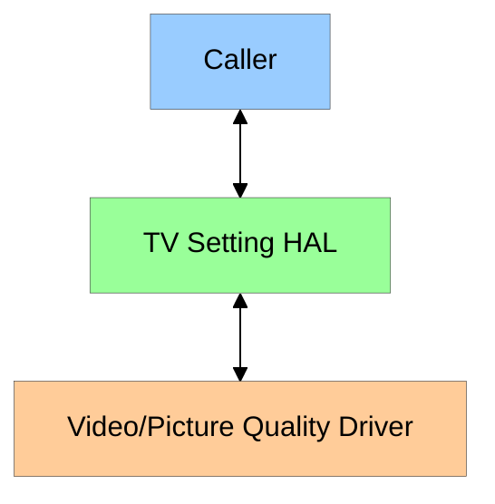
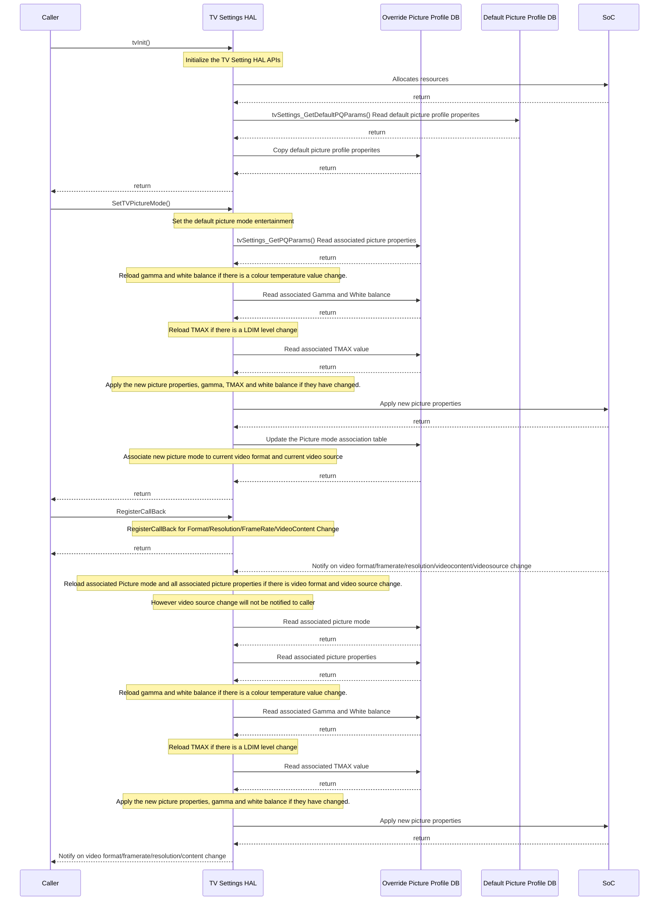
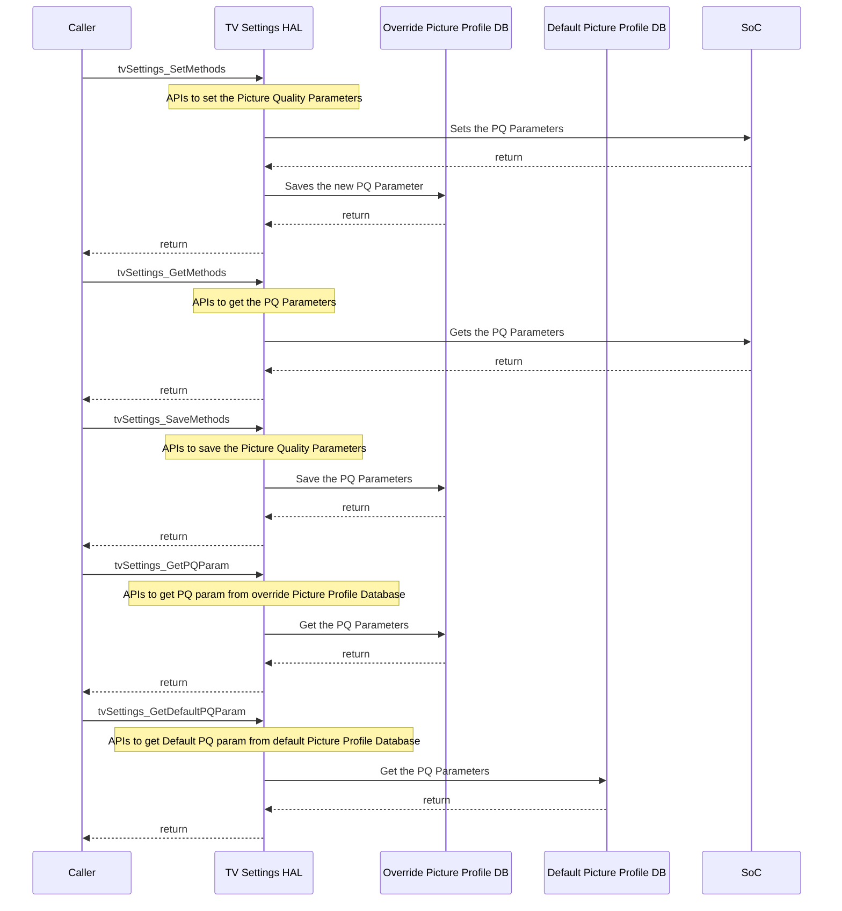
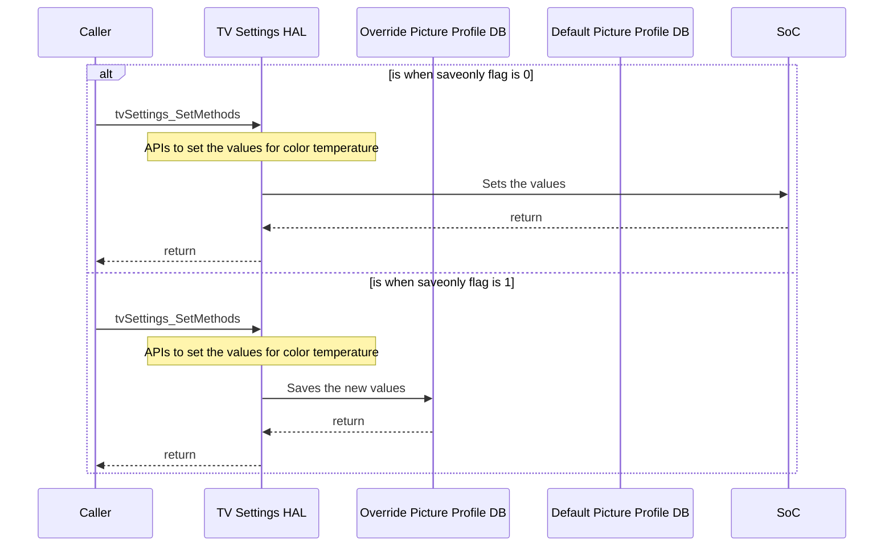
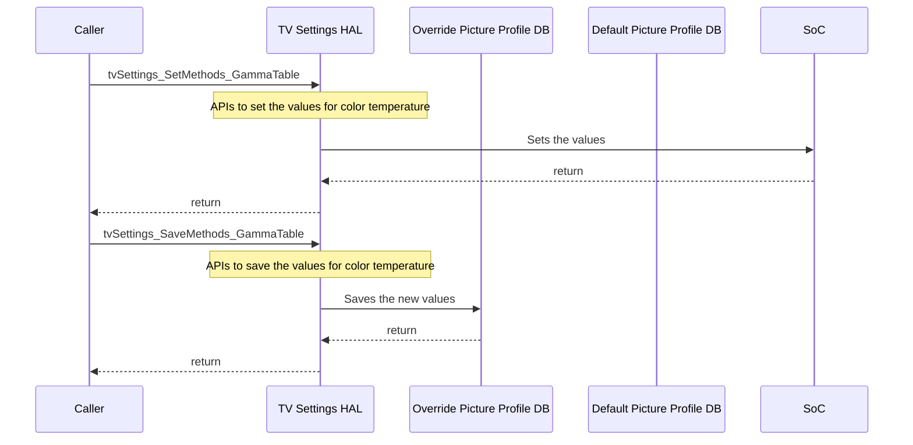
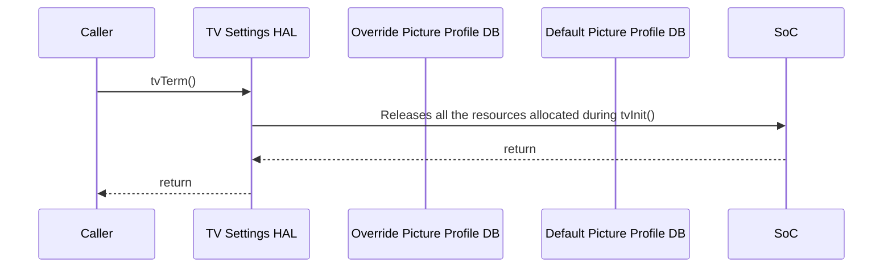
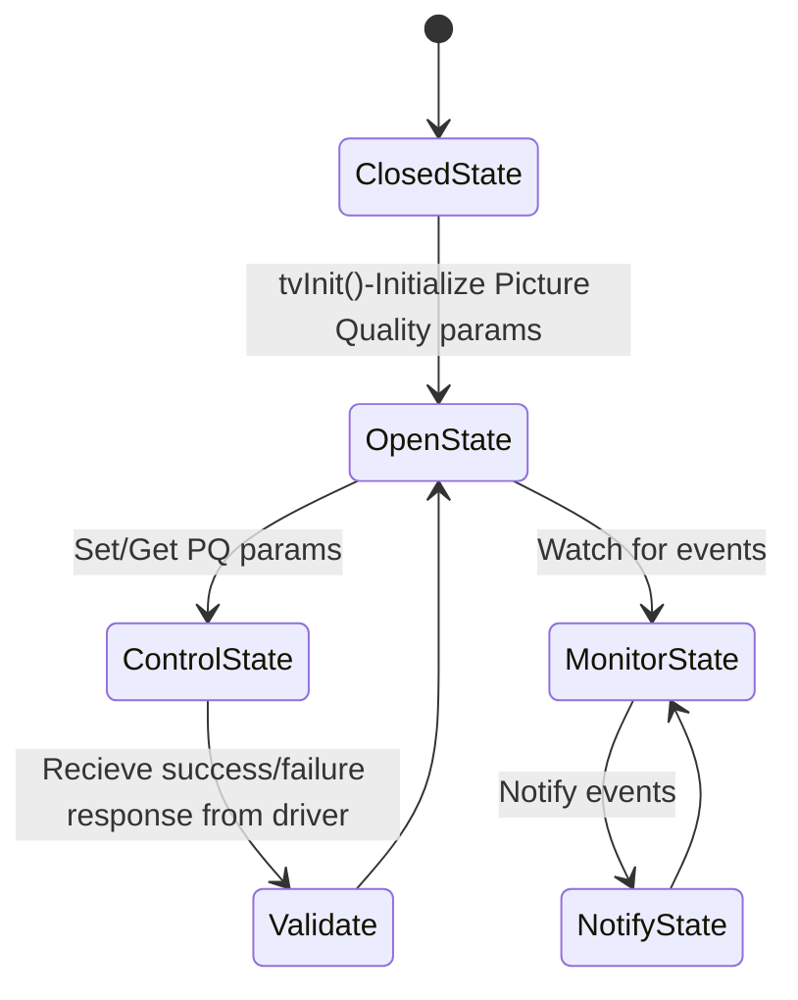

# TV Settings HAL Documentation

## Table of Contents

- [Acronyms, Terms and Abbreviations](#acronyms-terms-and-abbreviations)
- [Description](#description)
- [Component Runtime Execution Requirements](#component-runtime-execution-requirements)
  - [Initialization and Startup](#initialization-and-startup)
  	- [Table Format](#table-format) 
  - [Threading Model](#threading-model)
  - [Process Model](#process-model)
  - [Memory Model](#memory-model)
  - [Power Management Requirements](#power-management-requirements)
  - [Asynchronous Notification Model](#asynchronous-notification-model)
  - [Blocking calls](#blocking-calls)
  - [Internal Error Handling](#internal-error-handling)
  - [Persistence Model](#persistence-model)
- [Non-functional requirements](#non-functional-requirements)
  - [Logging and debugging requirements](#logging-and-debugging-requirements)
  - [Memory and performance requirements](#memory-and-performance-requirements)
  - [Quality Control](#quality-control)
  - [Licensing](#licensing)
  - [Build Requirements](#build-requirements)
  - [Variability Management](#variability-management)
  - [Platform or Product Customization](#platform-or-product-customization)
- [Interface API Documentation](#interface-api-documentation)
  - [Theory of operation and key concepts](#theory-of-operation-and-key-concepts)
  - [Public API Coverage](#public-api-coverage)
  - [Diagrams](#diagrams)

## Acronyms, Terms and Abbreviations

- `CPU` - Central Processing Unit
- `HAL` - Hardware Abstraction layer
- `PQ`  - Picture Quality
- `SOC` - System on chip
- `OEM` - Original Equipment Manufacturer
- `ALS` - Auto Light Sensor
- `API` - Application Programming Interface
- `DV`  - Dolby Vision
- `CMS` - Colorspace Management System
- `TMAX`- Temperature MAX
- `SRD` - Standard Dynamic Range
- `HDR` - High Dynamic Range
- `HLG` - Hybrid Log Gamma
- `UHD` - Ultra High Definition
- `LDIM`- Local Dimming

## Description

TV Settings `HAL` is an interface which provides `APIs` to modify/control picture quality parameters, backlight controls, dimming modes, local dimming, backlight dimming level, white-balance and calibration features.

```mermaid
%%{ init : { "theme" : "forest", "flowchart" : { "curve" : "linear" }}}%%
flowchart TD
Caller <--> x[TV Setting HAL] 
x[TV Setting HAL] <--> y[Video/Picture Quality Driver]
style Caller fill:#99CCFF,stroke:#333,stroke-width:0.3px
style y fill:#fc9,stroke:#333,stroke-width:0.3px
style x fill:#9f9,stroke:#333,stroke-width:0.3px
```
	
## Component Runtime Execution Requirements

### Initialization and Startup

The caller must initialize the `APIs` with picture quality modes for specific platforms and initiates communication with picture quality drivers. The standard/default values shall be maintained in default Picture profile database and any modified values for these parameters using TV Settings HAL APIs will be maintained in override Picture profile database. HAL shall be responsible to store these Picture profile data into the database.
Picture profile database will have 5 types of tables:
1. Picture property table to maintain all picture properties for a given picture mode, video format and video source
2. Picture mode association table maintain the association of a given video source and video format to a picture mode
3. If input source, picture mode, and video format are not already set or specified, they will default to "IP source," "Entertainment," and "SDR," respectively. However, if the caller attempts to change parameters that rely on these values, they will be acted upon default values accordingly.
4. White balance table for every color temperature and video source to maintain WB calibrated values
5. Gamma table for every color temperature to maintain the gamma calibrated values.
6. TMAX table for every local dimming level to maintain the TMAX value

- The capabilities of a specific platform with respect to TV picture configuration are defined in capability config files ([pq_capabilities.json](https://github.com/rdkcentral/rdkv-halif-tvsettings/blob/main/config/pq_capabilities.json) and [pq_capabilities.ini](https://github.com/rdkcentral/rdkv-halif-tvsettings/blob/main/config/pq_capabilities.ini)) which decide supported formats, picture modes, dimming modes, dimming levels, backlight modes, DV modes, and resolutions.
- Caller must initialize by calling `TvInit()` which must initialize the parameters in default picture property database. These parameters are decided by Soc vendor  based on platform capability.
- On every bootup the default picture profile database will be copied to override picture profile database.
  
#### Table Format
##### Picture Property Table
| Video Source | Video Format | Picture Mode | Picture Property |
| --- | --- | --- | --- |
| HDMI1 | SDR | Standard/Entertainment | Brightness |
|  |  |  | Contrast |
|  |  |  | Sharpness |
|  |  |  | Saturation |
|  |  |  | Hue |
|  |  |  | Backlight |
|  |  |  | Dolbymode |
|  |  |  | AspectRatio |
|  |  |  | Colortemperature |
|  |  |  | Dimming Mode |
|  |  |  | Local Dimming |
|  |  |  | Low Latency |
|  |  |  | CMS State |
|  |  |  | CMS Saturation RED |
|  |  |  | CMS Saturation BLUE |
|  |  |  | CMS Saturation GREEN |
|  |  |  | CMS Saturation YELLOW |
|  |  |  | CMS Saturation CYAN |
|  |  |  | CMS Saturation MAGENTA |
|  |  |  | CMS Hue RED |
|  |  |  | CMS Hue BLUE |
|  |  |  | CMS Hue GREEN |
|  |  |  | CMS Hue YELLOW |
|  |  |  | CMS Hue CYAN |
|  |  |  | CMS Hue MAGENTA |
|  |  |  | CMS Luma RED |
|  |  |  | CMS Luma BLUE |
|  |  |  | CMS Luma GREEN |
|  |  |  | CMS Luma YELLOW |
|  |  |  | CMS Luma CYAN |
|  |  |  | CMS Luma MAGENTA |
|  |  |  | Custom WhiteBalance Gain RED |
|  |  |  | Custom WhiteBalance Gain GREEN |
|  |  |  | Custom WhiteBalance Gain BLUE |
|  |  |  | Custom WhiteBalance Offset RED |
|  |  |  | Custom WhiteBalance Offset GREEN |
|  |  |  | Custom WhiteBalance Offset BLUE |
|  |  | Theater/Movie | Repeat as standard |
|  |  | FilmMaker | Repeat as standard |
|  |  | Sports | Repeat as standard |
|  |  | Game | Repeat as standard |
|  |  | Custom/Expert | Repeat as standard |
|  |  | EnergySaving | Repeat as standard |
|  |  | Vivid | Repeat as standard |
|  |  | Graphics | Repeat as standard |
|  | HDR10 | Repeat as SDR |
|  | HLG | Repeat as SDR |
|  | DV | Repeat as SDR |
| HDMI2 | Repeat as HDMI1 |
| HDMI3 | Repeat as HDMI1 |
| Tunner | Repeat as HDMI1 |
| IP | Repeat as HDMI1 |
| Composite | Repeat as HDMI1 |

Note: Currently Dolby mode is treated as a picture property and not a picture mode. In future Dolby mode might be treated as picture mode. Values of index in pq_capabilites.ini are mapped to enum values in tvTypes.h

##### Picture Association Table
| Video Source | Video Format | Picture Mode |
| --- | --- | --- |
| HDMI1 | SDR | Standard/Entertainment |
|  |  | Theater/Movie |
|  |  | FilmMaker |
|  |  | Sports |
|  |  | Game |
|  |  | Custom/Expert |
|  |  | EnergySaving |
|  |  | Vivid |
|  |  | Graphics |
|  | HDR10 | Repeat as SDR |
|  | HLG | Repeat as SDR |
|  | DV | Repeat as SDR |
| HDMI2 | Repeat as HDMI1 |
| HDMI3 | Repeat as HDMI1 |
| Tunner | Repeat as HDMI1 |
| IP | Repeat as HDMI1 |
| Composite | Repeat as HDMI1 |

##### WB Table
| Video Source | White Balance | Property | Value Range |
| --- | --- | --- | --- |
| HDMI1 | Cold White Balance Table | Red Gain | 0-2047 |
|  |  | Green Gain | 0-2047 |
|  |  | Blue Gain | 0-2047 |
|  |  | Red offset | (-1024) to (+1023) |
|  |  | Green offset | (-1024) to (+1023) |
|  |  | Blue offset | (-1024) to (+1023) |
|  | Warm White Balance Table | Repeat as Cold White Balance Table |
|  | Normal White Balance Table | Repeat as Cold White Balance Table |
|  | User White Balance Table | Repeat as Cold White Balance Table |
|  | Boost cold White Balance Table | Repeat as Cold White Balance Table |
|  | Bost warm White Balance Table | Repeat as Cold White Balance Table |
|  | Boost normal White Balance Table | Repeat as Cold White Balance Table |
|  | Boost user White Balance Table | Repeat as Cold White Balance Table |
| HDMI2 | Repeat as HDMI1 |
| HDMI3 | Repeat as HDMI1 |
| Tunner | Repeat as HDMI1 |
| IP | Repeat as HDMI1 |
| Composite | Repeat as HDMI1 |

##### Gamma Table
| Gamma | Index | Property | Value Range |
| --- | --- | --- | --- |
| Cold Gamma Table | 0 | Red Gain | 0-1023 |
|  |  | Green Gain | 0-1023 |
|  |  | Blue Gain | 0-1023 |
|  | 1 | Repeat as 0 |
|  | 2 | Repeat as 0 |
|  | . | |
|  | 254 | Repeat as 0 |
|  | 255 | Repeat as 0 |
| Warm Gamma Table |Repeat as Cold Gamma Table |
| Normal Gamma Table | Repeat as Cold Gamma Table |
| User Gamma Table | Repeat as Cold Gamma Table |
| Boorst cold Gamma Table | Repeat as Cold Gamma Table |
| Boost warm Gamma Table | Repeat as Cold Gamma Table |
| Boost normal Gamma Table | Repeat as Cold Gamma Table |
| Boost user Gamma Table | Repeat as Cold Gamma Table |

##### TMAX Table
| TMAX | Value Range |
| --- | --- |
| Non Boost | 0 to 10000 |
| Boost | 0 to 10000 |
| Burst | 0 to 10000 |

### Threading Model

This interface is not required to be thread safe. 
There are no constraints on thread creation or signal handling. 

### Process Model

This interface is expected to support a single instantiation with a single process.

### Memory Model

The caller is responsible for allocating and cleaning up any memory used.

### Power Management Requirements

This interface is not required to participate in power management.

### Asynchronous Notification Model

This interface requires callback notification registration for VideoFormatChange, VideoResolutionChange, VideoFrameRateChange, VideoContentChange. The caller must return the callback context as fast as possible and will not block.

### Blocking calls

This interface is required to have no blocking calls.

### Internal Error Handling

All `APIs` must return error synchronously as return argument.

### Persistence Model

Each vendor needs to define their own config file which is expected to be stored in rootfs and this must be a readonly.
Config files must contain the supported formats, picture modes, dimming modes, dimming levels, backlight modes, DV modes, resolutions, and per-context constraints.

## Non-functional requirements

Following non-functional requirement must be supported by the TV Settings `HAL` component:

### Logging and debugging requirements

This interface is required to support DEBUG, INFO and ERROR messages. DEBUG is required to be disabled by default and enabled when needed.

### Memory and performance requirements

This interface is required  to not cause excessive memory and `CPU` utilization.

### Quality Control

- This interface is required to perform static analysis, our preferred tool is Coverity.
- Have a zero-warning policy with regards to compiling. All warnings must be treated as errors.
- Use of memory analysis tools like Valgrind are encouraged to identify leaks/corruptions.
- `HAL` Tests will endeavour to create worst case scenarios to assist investigations.
- Copyright validation is required to be performed, e.g.: `Black duck`, `FossID`.
- Improvements by any party to the testing suite are required to be fed back.

### Licensing

This interface is expected to get released under the Apache License 2.0.

### Build Requirements

TV Settings `HAL` source code must build into a shared library and must be named as `libtvsettings-hal.so`.
  
### Variability Management

Any changes in the `APIs` must be reviewed and approved by component architects.

### Platform or Product Customization

Product or platform specification requirements will be handled in vendor specific config file.

## Interface API Documentation

`API` documentation will be provided by Doxygen which will be generated from the header file(s).

### Theory of operation and key concepts

This interface handles various functionalities/requests related to Picture Quality settings :

- Brightness, Contrast, Hue, Saturation, and Sharpness
- Color Temperature, 2-point white balance, and multi-point white balance
- Backlight value, Backlight mode, Dimming mode, Local Dimming Level, and Backlight Dimming Level
- Aspect Ratio and Low Latency state
- Precision Detail, SDR Gamma, Local Contrast Enhancement
- MPEG Noise Reduction, Digital Noise Reduction, AI Super Resolution, and MEMC
- CMS tuning and state control
- DV end-user calibration (refer tvDVCalibrationSettings_t)
- Notify Video Source, Video Format, Video Resolution, Video FrameRate and Video Content Change

There are other platform specific Picture Quality settings that can be managed by this interface :

- LDIM test and diagnostics controls
- Gamma/Gray/RGB pattern controls for factory calibration

### Public API Coverage

The public interface in `include/tvSettings.h` is organized into functional API groups. Unless specified otherwise, `Set*` updates active runtime values, `Get*` reads current runtime values, `Save*` persists values to the override picture profile database for a context, and `*Caps` reports supported ranges/options and contexts via `tvContextCaps_t`.

#### Lifecycle and callback registration

- `TvInit()` and `TvTerm()` manage HAL lifecycle.
- Callback registration APIs include `RegisterVideoFormatChangeCB()`, `RegisterVideoSourceChangeCB()`, `RegisterVideoContentChangeCB()`, `RegisterVideoResolutionChangeCB()`, and `RegisterVideoFrameRateChangeCB()`.

#### Video source/format/resolution and picture-mode discovery

- Runtime getters: `GetCurrentVideoSource()`, `GetCurrentVideoFormat()`, `GetCurrentVideoResolution()`, `GetCurrentVideoFrameRate()`.
- Supported-list getters: `GetTVSupportedVideoSources()`, `GetTVSupportedVideoFormats()`, `GetTVSupportedPictureModes()`, `GetTVSupportedDolbyVisionModes()`.
- Capability getters: `GetVideoSourceCaps()`, `GetVideoFormatCaps()`, `GetVideoResolutionCaps()`, `GetVideoFrameRateCaps()`, `GetTVPictureModeCaps()`.
- Picture mode control: `GetTVPictureMode()`, `SetTVPictureMode()`, `SaveSourcePictureMode()`, `GetDefaultPQMode()`.

#### Backlight, dimming and LDIM controls

- Backlight value APIs: `GetBacklightCaps()`, `GetBacklight()`, `SetBacklight()`, `SaveBacklight()`.
- Backlight fade APIs: `SetBacklightFade()`, `GetCurrentBacklightFade()`.
- Backlight mode APIs: `GetSupportedBacklightModes()`, `GetCurrentBacklightMode()`, `SetCurrentBacklightMode()`, `GetBacklightModeCaps()`, `SaveBacklightMode()`.
- Dimming mode APIs: `GetTVSupportedDimmingModes()`, `SetTVDimmingMode()`, `GetTVDimmingMode()`, `SaveTVDimmingMode()`, `GetTVDimmingModeCaps()`.
- Local dimming APIs: `SetLocalDimmingLevel()`, `GetLocalDimmingLevel()`, `SaveLocalDimmingLevel()`.
- Backlight dimming level APIs: `GetBacklightDimmingLevelCaps()`, `SetBacklightDimmingLevel()`, `GetBacklightDimmingLevel()`.
- LDIM diagnostics/test APIs: `GetOpenCircuitStatus()`, `GetLdimZoneShortCircuitStatus()`, `GetNumberOfDimmingZones()`, `EnableLDIMPixelCompensation()`, `EnableLDIM()`, `StartLDIMSequenceTest()`, `SetBacklightTestMode()`.

#### Core PQ controls

- Core controls with caps/get/set/save are available for Brightness, Contrast, Sharpness, Saturation and Hue.
- Additional controls include Color Temperature (`SetColorTemperature()`, `GetColorTemperature()`, `SaveColorTemperature()`, `GetColorTemperatureCaps()`), Aspect Ratio (`SetAspectRatio()`, `GetAspectRatio()`, `SaveAspectRatio()`, `GetAspectRatioCaps()`), and Low Latency (`SetLowLatencyState()`, `GetLowLatencyState()`, `SaveLowLatencyState()`, `GetLowLatencyStateCaps()`).

#### White balance, gamma and calibration

- Source-specific white balance trim APIs: `Set/GetColorTemp_*_onSource()` variants.
- White balance calibration mode: `EnableWBCalibrationMode()`, `GetCurrentWBCalibrationMode()`.
- 2-point white balance: `Set2PointWB()`, `Get2PointWB()`, `Save2PointWB()`, `GetDefault2PointWB()`, `Get2PointWBCaps()`.
- Custom 2-point white balance: `SetCustom2PointWhiteBalance()`, `GetCustom2PointWhiteBalance()`, `SaveCustom2PointWhiteBalance()`, `GetCustom2PointWhiteBalanceCaps()`.
- Gamma and patterns: `SetGammaTable()`, `GetGammaTable()`, `GetDefaultGammaTable()`, `SaveGammaTable()`, `EnableGammaMode()`, `SetGammaPattern()`, `SetGammaPatternMode()`, `SetRGBPattern()`, `GetRGBPattern()`, `SetGrayPattern()`, `GetGrayPattern()`, `GetTVGammaTarget()`.
- Dolby Vision calibration: `GetDVCalibrationCaps()`, `SetDVCalibration()`, `GetDVCalibration()`, `GetDVCalibrationDefault()`, and DV Tmax controls (`SetDvTmaxValue()`, `GetDvTmaxValue()`, `SaveDvTmaxValue()`).

#### CMS and advanced PQ features

- CMS tuning APIs: `GetSupportedComponentColor()`, `Set/GetCurrentComponentSaturation()`, `Set/GetCurrentComponentHue()`, `Set/GetCurrentComponentLuma()`, `SaveCMS()`, `SetCMSState()`, `GetCMSState()`, `GetCMSCaps()`.
- Advanced PQ feature APIs: `Get/Set` and `*Caps` for Precision Detail, SDR Gamma, Local Contrast Enhancement, MPEG Noise Reduction, Digital Noise Reduction, AI Super Resolution, and MEMC.
- Multi-point white balance APIs: `GetMultiPointWBCaps()`, `SetMultiPointWBMatrix()`, `GetMultiPointWBMatrix()`.

#### Generic parameter APIs

- Generic parameter lookup APIs include `GetPQParams()` and `GetDefaultPQParams()` and are used by runtime workflows and persistence flow.
- API expansion in `tvSettings.h` with broad capability-query (`*Caps`) coverage and context-driven APIs.
- Addition of `RegisterVideoSourceChangeCB()` callback and `GetDefaultPQMode()` default mode API.
- Addition of Backlight Dimming Level APIs and related parameter index entries.
- Expansion of advanced PQ controls (Precision Detail, SDR Gamma, Local Contrast Enhancement, MPEG/Digital Noise Reduction, AI Super Resolution, MEMC, Multi-point WB, DV calibration).
- `tvPQModeIndex_t` expansion with `PQ_MODE_AIPQ`, `PQ_MODE_DARK`, `PQ_MODE_BRIGHT`, `PQ_MODE_IQ`, and `PQ_MODE_DISABLE`.
- Capability model updates in `pq_capabilities.json`, including `DimmingLevel` support and source-name normalization from `Composite` to `Composite1`.
- ODM-facing headers reduced to a minimal surface where `tvSettingsODM.h` exposes gamma test-point hooks and `tvTypesODM.h` keeps ODM gamma structure definitions.

### Diagrams

#### Operational Call Diagram
##### Init and Callback Sequence

```mermaid
sequenceDiagram
participant Caller as Caller
    participant HAL as TV Settings HAL
    participant OPPDB as Override Picture Profile DB
    participant DPPDB as Default Picture Profile DB
    participant Driver as SoC

    Caller->>HAL:tvInit()
    Note over HAL: Initialize the TV Setting HAL APIs
    HAL->>Driver: Allocates resources
    Driver-->>HAL:return
    HAL->>DPPDB: tvSettings_GetDefaultPQParams() Read default picture profile properites
    DPPDB-->>HAL:return
    HAL->>OPPDB: Copy default picture profile properites
    OPPDB-->>HAL:return
    HAL-->>Caller:return
    Caller->>HAL: SetTVPictureMode()
    Note over HAL: Set the default picture mode entertainment
    HAL->>OPPDB: tvSettings_GetPQParams() Read associated picture properties
    OPPDB-->>HAL:return
    Note over HAL: Reload gamma and white balance if there is a colour temperature value change.
    HAL->>OPPDB: Read associated Gamma and White balance
    OPPDB-->>HAL:return
    Note over HAL: Reload TMAX if there is a LDIM level change
    HAL->>OPPDB: Read associated TMAX value
    OPPDB-->>HAL:return
    Note over HAL: Apply the new picture properties, gamma, TMAX and white balance if they have changed.
    HAL->>Driver: Apply new picture properties
    Driver-->>HAL:return
    HAL->>OPPDB: Update the Picture mode association table
    Note over HAL: Associate new picture mode to current video format and current video source
    OPPDB-->>HAL:return
    HAL-->>Caller:return

    Caller->>HAL: RegisterCallBack
    Note over HAL:RegisterCallBack for Format/Resolution/FrameRate/VideoContent Change
    HAL-->>Caller:return

    Driver-->>HAL:Notify on video format/framerate/resolution/videocontent/videosource change
    Note over HAL: Reload associated Picture mode and all associated picture properties if there is video format and video source change.
    Note over HAL: However video source change will not be notified to caller
    HAL->>OPPDB: Read associated picture mode
    OPPDB-->>HAL:return
    HAL->>OPPDB: Read associated picture properties
    OPPDB-->>HAL:return
    Note over HAL: Reload gamma and white balance if there is a colour temperature value change.
    HAL->>OPPDB: Read associated Gamma and White balance
    OPPDB-->>HAL:return
    Note over HAL: Reload TMAX if there is a LDIM level change
    HAL->>OPPDB: Read associated TMAX value
    OPPDB-->>HAL:return
    Note over HAL: Apply the new picture properties, gamma and white balance if they have changed.
    HAL->>Driver: Apply new picture properties
    Driver-->>HAL: return
    HAL-->>Caller:Notify on video format/framerate/resolution/content change
```

##### Set/Get/Save Picture Quality Parameter Sequence

```mermaid
sequenceDiagram
participant Caller as Caller
    participant HAL as TV Settings HAL
    participant OPPDB as Override Picture Profile DB
    participant DPPDB as Default Picture Profile DB
    participant Driver as SoC

    Caller->>HAL: tvSettings_SetMethods
    Note over HAL: APIs to set the Picture Quality Parameters
    HAL->>Driver:Sets the PQ Parameters
    Driver-->>HAL:return
    HAL->>OPPDB: Saves the new PQ Parameter
    OPPDB-->>HAL:return
    HAL-->>Caller:return

    Caller->>HAL: tvSettings_GetMethods
    Note over HAL: APIs to get the PQ Parameters
    HAL->>Driver:Gets the PQ Parameters
    Driver-->>HAL:return
    HAL-->>Caller:return

    Caller->>HAL: tvSettings_SaveMethods
    Note over HAL: APIs to save the Picture Quality Parameters
    HAL->>OPPDB:Save the PQ Parameters
    OPPDB-->>HAL:return
    HAL-->>Caller:return

    Caller->>HAL: tvSettings_GetPQParam
    Note over HAL: APIs to get PQ param from override Picture Profile Database
    HAL->>OPPDB:Get the PQ Parameters
    OPPDB-->>HAL:return
    HAL-->>Caller:return

    Caller->>HAL: tvSettings_GetDefaultPQParam
    Note over HAL: APIs to get Default PQ param from default Picture Profile Database
    HAL->>DPPDB:Get the PQ Parameters
    DPPDB-->>HAL:return
    HAL-->>Caller:return
```
<h5> LEGEND: </h5>

<h5>tvSettings_SetMethods:</h5>
SetBrightness(), SetContrast(), SetSaturation(), SetHue(), SetSharpness(), SetColorTemperature(), SetBacklight(), SetCurrentBacklightMode(), SetTVDimmingMode(), SetBacklightDimmingLevel(), etc.

<h5>tvSettings_GetMethods:</h5> 
GetBrightness(), GetContrast(), GetSaturation(), GetHue(), GetSharpness(), GetColorTemperature(), GetBacklight(), GetBacklightDimmingLevel(), GetBacklightDimmingLevelCaps(), GetPQParams(), GetDefaultPQParams(), GetDefaultPQMode() etc.
 
<h5>tvSettings_SaveMethods :</h5> 
SaveBrightness(), SaveContrast(), SaveSaturation(), SaveHue(), SaveSharpness(), SaveColorTemperature(), SaveBacklight(), SaveBacklightMode(), SaveTVDimmingMode(), etc.
  
<h5>RegisterCallback :</h5>
RegisterVideoFormatChangeCB(), RegisterVideoSourceChangeCB(), RegisterVideoContentChangeCB(), RegisterVideoResolutionChangeCB(), RegisterVideoFrameRateChangeCB()

##### Set With SaveOnly Flag Sequence

```mermaid
sequenceDiagram
participant Caller as Caller
    participant HAL as TV Settings HAL
    participant OPPDB as Override Picture Profile DB
    participant DPPDB as Default Picture Profile DB
    participant Driver as SoC

    alt is when saveonly flag is 0
    Caller->>HAL: tvSettings_SetMethods
    Note over HAL: APIs to set the values for color temperature
    HAL->>Driver:Sets the values
    Driver-->>HAL:return
    HAL-->>Caller:return
    else is when saveonly flag is 1
    Caller->>HAL: tvSettings_SetMethods
    Note over HAL: APIs to set the values for color temperature
    HAL->>OPPDB: Saves the new values
    OPPDB-->>HAL:return
    HAL-->>Caller:return
    end
```
<h5> LEGEND: </h5>

<h5>tvSettings_SetMethods:</h5>
SetColorTemp_Rgain_onSource(), SetColorTemp_Ggain_onSource(), SetColorTemp_Bgain_onSource(), SetColorTemp_R_post_offset_onSource(), SetColorTemp_G_post_offset_onSource(), SetColorTemp_B_post_offset_onSource()

##### Gamma/TMax sequence(set and save)

```mermaid
sequenceDiagram
participant Caller as Caller
    participant HAL as TV Settings HAL
    participant OPPDB as Override Picture Profile DB
    participant DPPDB as Default Picture Profile DB
    participant Driver as SoC

    Caller->>HAL: tvSettings_SetMethods_GammaTable
    Note over HAL: APIs to set the values for color temperature
    HAL->>Driver:Sets the values
    Driver-->>HAL:return
    HAL-->>Caller:return

    Caller->>HAL: tvSettings_SaveMethods_GammaTable
    Note over HAL: APIs to save the values for color temperature
    HAL->>OPPDB: Saves the new values
    OPPDB-->>HAL:return
    HAL-->>Caller:return
```
<h5> LEGEND: </h5>

<h5>tvSettings_SetMethods:</h5>
SetGammaTable(), SetDvTmaxValue()
 
<h5>tvSettings_SaveMethods :</h5> 
SaveGammaTable(), SaveDvTmaxValue()

##### Terminate Sequence

```mermaid
sequenceDiagram
participant Caller as Caller
    participant HAL as TV Settings HAL
    participant OPPDB as Override Picture Profile DB
    participant DPPDB as Default Picture Profile DB
    participant Driver as SoC

    Caller ->>HAL:tvTerm()
    HAL ->> Driver: Releases all the resources allocated during tvInit()
    Driver-->>HAL:return
    HAL-->>Caller:return
```

#### Functional Diagram

```mermaid
stateDiagram-v2
    [*] --> ClosedState
    ClosedState --> OpenState: tvInit()-Initialize Picture Quality params
    OpenState --> ControlState: Set/Get PQ params
    ControlState --> Validate: Recieve success/failure response from driver
    Validate --> OpenState
    OpenState --> MonitorState: Watch for events
    MonitorState --> NotifyState: Notify events
    NotifyState --> MonitorState
```
